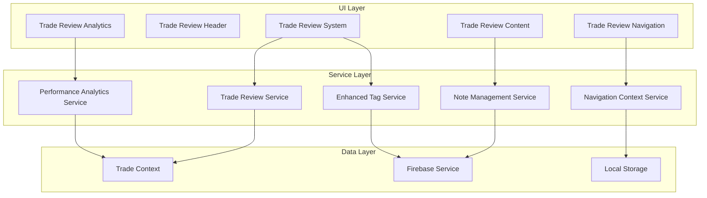

# Design Document

## Overview

The Comprehensive Trade Review System enhances the existing `TradeOverview` component to create a systematic, full-page experience for reviewing and managing individual trades. The system builds upon the current architecture while adding advanced features for note-taking, tag management, performance analytics, and contextual navigation.

The design leverages the existing trade data structure, tag system, and Firebase integration while introducing new components and services to support comprehensive trade analysis and review workflows.

## Architecture

### High-Level Architecture



### Component Hierarchy

```
TradeReviewSystem
├── TradeReviewHeader
│   ├── TradeNavigationControls
│   ├── TradeStatusIndicators
│   └── ActionButtons
├── TradeReviewNavigation
│   ├── ContextualBackButton
│   ├── TradeSequenceNavigation
│   └── QuickFilters
├── TradeReviewContent
│   ├── TradeDataPanel
│   │   ├── ExecutionDetails
│   │   ├── RiskManagement
│   │   └── TimingInformation
│   ├── AnalysisPanel
│   │   ├── ChartGallery
│   │   ├── NotesEditor
│   │   └── TagManager
│   ├── PerformancePanel
│   │   ├── MetricsDisplay
│   │   ├── ComparisonCharts
│   │   └── AnalyticsInsights
│   └── ReviewWorkflowPanel
│       ├── ReviewStages
│       ├── CompletionTracker
│       └── ActionItems
└── TradeReviewFooter
    ├── ExportOptions
    ├── SharingControls
    └── PrintOptions
```

## Components and Interfaces

### Core Components

#### 1. TradeReviewSystem (Main Container)

**Purpose:** Main container component that orchestrates the entire trade review experience.

**Props:**
```typescript
interface TradeReviewSystemProps {
  tradeId: string;
  navigationContext?: NavigationContext;
  initialMode?: 'view' | 'edit' | 'review';
  onNavigateBack?: (context: NavigationContext) => void;
}
```

**Key Features:**
- Manages overall state and mode switching
- Handles navigation context preservation
- Coordinates between child components
- Manages auto-save functionality

#### 2. TradeReviewHeader

**Purpose:** Enhanced header with contextual navigation and trade status indicators.

**Props:**
```typescript
interface TradeReviewHeaderProps {
  trade: Trade;
  navigationContext: NavigationContext;
  isEditing: boolean;
  onModeChange: (mode: 'view' | 'edit' | 'review') => void;
  onNavigateBack: () => void;
  onNavigateToTrade: (tradeId: string) => void;
}
```

**Key Features:**
- Contextual back button with smart labeling
- Trade sequence navigation (previous/next)
- Mode switching controls
- Trade status and performance indicators

#### 3. EnhancedNotesEditor

**Purpose:** Advanced note-taking component with multiple categories and rich formatting.

**Props:**
```typescript
interface EnhancedNotesEditorProps {
  trade: Trade;
  isEditing: boolean;
  onNotesChange: (notes: TradeNotes) => void;
  templates?: NoteTemplate[];
}

interface TradeNotes {
  preTradeAnalysis?: string;
  executionNotes?: string;
  postTradeReflection?: string;
  lessonsLearned?: string;
  generalNotes?: string;
  lastModified: string;
  version: number;
}
```

**Key Features:**
- Multiple note categories with tabs
- Rich text formatting support
- Note templates and suggestions
- Version history and timestamps
- Auto-save functionality

#### 4. AdvancedTagManager

**Purpose:** Comprehensive tag management with intelligent suggestions and performance tracking.

**Props:**
```typescript
interface AdvancedTagManagerProps {
  trade: Trade;
  isEditing: boolean;
  onTagsChange: (tags: string[]) => void;
  showPerformance?: boolean;
}
```

**Key Features:**
- Visual tag categories with color coding
- Intelligent tag suggestions based on trade data
- Tag performance metrics display
- Bulk tag operations
- Tag validation and sanitization

#### 5. PerformanceAnalyticsPanel

**Purpose:** Comprehensive performance analysis with visual indicators and comparisons.

**Props:**
```typescript
interface PerformanceAnalyticsPanelProps {
  trade: Trade;
  similarTrades: Trade[];
  benchmarkData?: BenchmarkData;
  showComparisons?: boolean;
}
```

**Key Features:**
- Real-time performance calculations
- Visual performance indicators
- Comparison with similar trades
- Performance trend analysis
- Risk-adjusted metrics

#### 6. ChartGalleryManager

**Purpose:** Enhanced chart management with annotation capabilities.

**Props:**
```typescript
interface ChartGalleryManagerProps {
  trade: Trade;
  isEditing: boolean;
  onChartsChange: (charts: TradeChart[]) => void;
}

interface TradeChart {
  id: string;
  url: string;
  type: 'entry' | 'exit' | 'analysis' | 'post_mortem';
  timeframe: string;
  annotations?: ChartAnnotation[];
  uploadedAt: string;
  description?: string;
}
```

**Key Features:**
- Multiple chart upload and organization
- Chart annotation tools
- Timeframe categorization
- Zoom and full-screen viewing
- Chart comparison mode

### Service Layer

#### 1. NavigationContextService

**Purpose:** Manages navigation context and provides intelligent back navigation.

```typescript
interface NavigationContext {
  source: 'calendar' | 'trade-list' | 'search' | 'dashboard' | 'analytics';
  sourceParams?: {
    date?: string;
    filters?: any;
    searchQuery?: string;
    page?: number;
    sortBy?: string;
  };
  breadcrumb: string[];
  timestamp: number;
}

class NavigationContextService {
  setContext(context: NavigationContext): void;
  getContext(): NavigationContext | null;
  generateBackLabel(context: NavigationContext): string;
  getBackUrl(context: NavigationContext): string;
  clearContext(): void;
}
```

#### 2. TradeReviewService

**Purpose:** Manages trade review workflow and completion tracking.

```typescript
interface ReviewStage {
  id: string;
  name: string;
  description: string;
  required: boolean;
  completed: boolean;
  completedAt?: string;
  notes?: string;
}

interface ReviewWorkflow {
  tradeId: string;
  stages: ReviewStage[];
  overallProgress: number;
  startedAt: string;
  completedAt?: string;
  reviewerId?: string;
}

class TradeReviewService {
  initializeReview(tradeId: string): ReviewWorkflow;
  updateStage(tradeId: string, stageId: string, completed: boolean, notes?: string): void;
  getReviewProgress(tradeId: string): ReviewWorkflow;
  markReviewComplete(tradeId: string): void;
  getIncompleteReviews(): ReviewWorkflow[];
}
```

#### 3. NoteManagementService

**Purpose:** Handles advanced note operations including versioning and templates.

```typescript
interface NoteVersion {
  version: number;
  content: TradeNotes;
  timestamp: string;
  changes: string[];
}

interface NoteTemplate {
  id: string;
  name: string;
  category: string;
  template: Partial<TradeNotes>;
  description: string;
}

class NoteManagementService {
  saveNotes(tradeId: string, notes: TradeNotes): Promise<void>;
  getNoteHistory(tradeId: string): Promise<NoteVersion[]>;
  applyTemplate(template: NoteTemplate, existingNotes: TradeNotes): TradeNotes;
  getTemplates(): NoteTemplate[];
  createTemplate(name: string, notes: TradeNotes): NoteTemplate;
}
```

#### 4. PerformanceAnalyticsService

**Purpose:** Provides advanced performance calculations and comparisons.

```typescript
interface PerformanceMetrics {
  rMultiple: number;
  returnPercentage: number;
  riskRewardRatio: number;
  holdDuration: number;
  efficiency: number;
  sharpeRatio?: number;
  maxDrawdown?: number;
}

interface TradeComparison {
  similarTrades: Trade[];
  averagePerformance: PerformanceMetrics;
  percentileRank: number;
  outperformanceFactors: string[];
  improvementSuggestions: string[];
}

class PerformanceAnalyticsService {
  calculateMetrics(trade: Trade): PerformanceMetrics;
  findSimilarTrades(trade: Trade, allTrades: Trade[]): Trade[];
  compareWithSimilar(trade: Trade, similarTrades: Trade[]): TradeComparison;
  generateInsights(trade: Trade, comparison: TradeComparison): string[];
  calculateBenchmarkPerformance(trades: Trade[]): PerformanceMetrics;
}
```

## Data Models

### Enhanced Trade Interface Extensions

```typescript
interface TradeReviewData {
  reviewWorkflow?: ReviewWorkflow;
  notes?: TradeNotes;
  charts?: TradeChart[];
  performanceMetrics?: PerformanceMetrics;
  lastReviewedAt?: string;
  reviewCompletionScore?: number;
}

// Extend existing Trade interface
interface EnhancedTrade extends Trade {
  reviewData?: TradeReviewData;
}
```

### Navigation and Context Models

```typescript
interface NavigationState {
  currentTradeId: string;
  context: NavigationContext;
  history: string[];
  canNavigateBack: boolean;
  canNavigateForward: boolean;
}

interface ViewState {
  mode: 'view' | 'edit' | 'review';
  activePanel: 'data' | 'analysis' | 'performance' | 'workflow';
  expandedSections: string[];
  unsavedChanges: boolean;
}
```

## Error Handling

### Error Types and Handling Strategy

```typescript
enum TradeReviewErrorType {
  TRADE_NOT_FOUND = 'TRADE_NOT_FOUND',
  NAVIGATION_CONTEXT_INVALID = 'NAVIGATION_CONTEXT_INVALID',
  SAVE_FAILED = 'SAVE_FAILED',
  CHART_UPLOAD_FAILED = 'CHART_UPLOAD_FAILED',
  PERFORMANCE_CALCULATION_ERROR = 'PERFORMANCE_CALCULATION_ERROR',
  REVIEW_WORKFLOW_ERROR = 'REVIEW_WORKFLOW_ERROR'
}

interface TradeReviewError {
  type: TradeReviewErrorType;
  message: string;
  details?: any;
  recoverable: boolean;
  suggestedAction?: string;
}

class ErrorHandlingService {
  handleError(error: TradeReviewError): void;
  showErrorToast(error: TradeReviewError): void;
  logError(error: TradeReviewError): void;
  getRecoveryActions(error: TradeReviewError): string[];
}
```

### Error Recovery Strategies

1. **Trade Not Found:** Redirect to trade list with error message
2. **Save Failures:** Implement retry mechanism with local backup
3. **Chart Upload Issues:** Provide alternative upload methods
4. **Performance Calculation Errors:** Show partial data with warnings
5. **Navigation Context Loss:** Provide default navigation options

## Testing Strategy

### Unit Testing

1. **Component Testing:**
   - TradeReviewSystem state management
   - NavigationContextService logic
   - PerformanceAnalyticsService calculations
   - NoteManagementService operations

2. **Service Testing:**
   - Navigation context preservation
   - Review workflow progression
   - Performance metric accuracy
   - Error handling scenarios

### Integration Testing

1. **Navigation Flow Testing:**
   - Calendar → Trade Review → Back to Calendar
   - Trade List → Trade Review → Back to Trade List
   - Search → Trade Review → Back to Search

2. **Data Persistence Testing:**
   - Note saving and versioning
   - Chart upload and management
   - Review workflow state persistence
   - Tag management operations

### End-to-End Testing

1. **Complete Review Workflow:**
   - Navigate to trade from different sources
   - Complete full review process
   - Verify data persistence
   - Test export functionality

2. **Performance Testing:**
   - Large dataset handling
   - Chart gallery performance
   - Real-time analytics updates
   - Navigation responsiveness

## Performance Considerations

### Optimization Strategies

1. **Lazy Loading:**
   - Chart images loaded on demand
   - Performance analytics calculated when panel is viewed
   - Note history loaded only when requested

2. **Caching:**
   - Navigation context cached in localStorage
   - Performance metrics cached with trade data
   - Chart thumbnails cached for quick preview

3. **Virtualization:**
   - Large chart galleries use virtual scrolling
   - Tag suggestions use debounced search
   - Performance comparisons paginated

4. **Memory Management:**
   - Cleanup chart image references on unmount
   - Debounce auto-save operations
   - Limit note version history retention

## Security Considerations

### Data Protection

1. **Sensitive Data Handling:**
   - Trade data encrypted in transit and at rest
   - Chart images stored securely with access controls
   - Note content sanitized to prevent XSS

2. **Access Control:**
   - User-specific trade data isolation
   - Secure chart upload with file type validation
   - Export functionality with user authentication

3. **Privacy:**
   - Navigation context doesn't expose sensitive data
   - Chart annotations stored separately from images
   - Review workflow data tied to user accounts

### Input Validation

1. **Trade Data Validation:**
   - Numeric field validation for prices and quantities
   - Date validation for timing information
   - Tag validation using existing tag service

2. **File Upload Security:**
   - Chart image type and size validation
   - Malware scanning for uploaded files
   - Secure file storage with access controls

## Accessibility

### WCAG 2.1 AA Compliance

1. **Keyboard Navigation:**
   - Full keyboard accessibility for all controls
   - Logical tab order through review sections
   - Keyboard shortcuts for common actions

2. **Screen Reader Support:**
   - Semantic HTML structure
   - ARIA labels for complex components
   - Live regions for dynamic content updates

3. **Visual Accessibility:**
   - High contrast mode support
   - Scalable text and UI elements
   - Color-blind friendly performance indicators

4. **Motor Accessibility:**
   - Large click targets for mobile
   - Drag-and-drop alternatives
   - Reduced motion options

## Mobile Responsiveness

### Responsive Design Strategy

1. **Layout Adaptation:**
   - Collapsible panels for mobile screens
   - Touch-friendly navigation controls
   - Optimized chart gallery for touch interaction

2. **Performance Optimization:**
   - Reduced data loading on mobile
   - Compressed chart images for mobile
   - Progressive enhancement for advanced features

3. **Touch Interactions:**
   - Swipe navigation between trades
   - Touch-optimized chart annotation tools
   - Mobile-friendly tag input interface