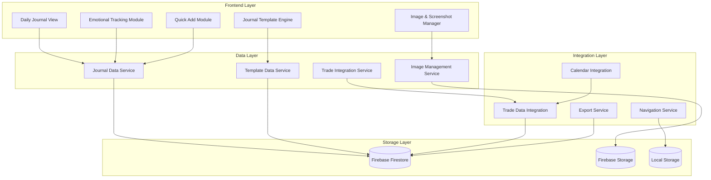
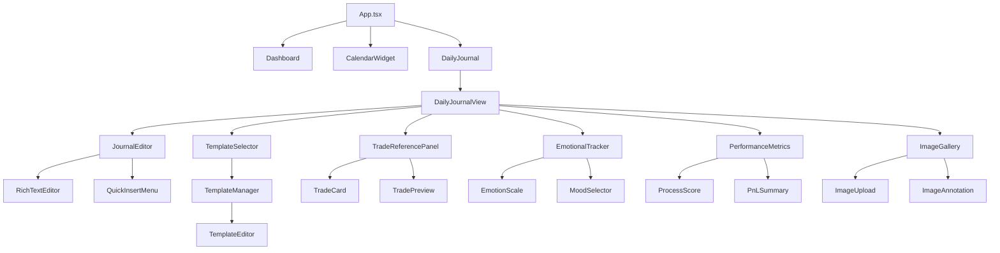

# Design Document

## Overview

The Daily Trading Journal feature is designed as a comprehensive solution to overcome the psychological and practical barriers that prevent traders from maintaining consistent journaling habits. Based on extensive research into trader psychology and existing system architecture, this design creates a frictionless, engaging, and insightful daily reflection environment that transforms journaling from a dreaded chore into an indispensable part of the trading process.

The system leverages the existing trade data infrastructure, calendar integration, and component architecture while introducing new capabilities for template management, emotional tracking, and process-focused performance assessment. The design prioritizes automation, user experience, and psychological engagement to maximize adoption and consistency.

## Architecture

### High-Level System Architecture



### Component Hierarchy



## Components and Interfaces

### Core Data Models

#### Journal Entry Interface
```typescript
interface JournalEntry {
  id: string;
  userId: string;
  date: string; // YYYY-MM-DD format
  createdAt: string;
  updatedAt: string;
  
  // Content sections
  preMarketNotes?: string;
  tradingNotes?: string;
  postMarketReflection?: string;
  lessonsLearned?: string;
  tomorrowsPlan?: string;
  
  // Template and structure
  templateId?: string;
  sections: JournalSection[];
  
  // Trade references
  tradeReferences: TradeReference[];
  
  // Emotional tracking
  emotionalState: EmotionalState;
  
  // Performance tracking
  processMetrics: ProcessMetrics;
  dailyPnL: number;
  
  // Media attachments
  images: JournalImage[];
  
  // Metadata
  tags: string[];
  isComplete: boolean;
  wordCount: number;
}

interface JournalSection {
  id: string;
  type: 'text' | 'checklist' | 'rating' | 'trade_reference' | 'image';
  title: string;
  content: any;
  order: number;
  isRequired: boolean;
}

interface TradeReference {
  tradeId: string;
  insertedAt: string;
  context: string; // Brief description of why this trade is referenced
  displayType: 'inline' | 'card' | 'preview';
}

interface EmotionalState {
  preMarket: {
    confidence: number; // 1-5 scale
    anxiety: number; // 1-5 scale
    focus: number; // 1-5 scale
    mood: 'excited' | 'calm' | 'nervous' | 'frustrated' | 'confident';
    notes?: string;
  };
  duringTrading: {
    discipline: number; // 1-5 scale
    patience: number; // 1-5 scale
    emotionalControl: number; // 1-5 scale
    notes?: string;
  };
  postMarket: {
    satisfaction: number; // 1-5 scale
    learningValue: number; // 1-5 scale
    overallMood: 'satisfied' | 'frustrated' | 'neutral' | 'excited' | 'disappointed';
    notes?: string;
  };
}

interface ProcessMetrics {
  planAdherence: number; // 1-5 scale
  riskManagement: number; // 1-5 scale
  entryTiming: number; // 1-5 scale
  exitTiming: number; // 1-5 scale
  overallDiscipline: number; // Calculated average
  processScore: number; // Weighted score emphasizing process over outcome
}

interface JournalImage {
  id: string;
  url: string;
  filename: string;
  uploadedAt: string;
  annotations: ImageAnnotation[];
  caption?: string;
  tradeId?: string; // If image is related to a specific trade
}

interface ImageAnnotation {
  id: string;
  type: 'text' | 'arrow' | 'highlight' | 'circle';
  position: { x: number; y: number };
  content: string;
  color: string;
}
```

#### Template System
```typescript
interface JournalTemplate {
  id: string;
  userId: string;
  name: string;
  description: string;
  category: 'pre-market' | 'post-market' | 'full-day' | 'custom';
  isDefault: boolean;
  isPublic: boolean;
  
  sections: TemplateSection[];
  
  createdAt: string;
  updatedAt: string;
  usageCount: number;
}

interface TemplateSection {
  id: string;
  type: 'text' | 'checklist' | 'rating' | 'emotion_tracker' | 'trade_reference';
  title: string;
  prompt: string;
  placeholder?: string;
  isRequired: boolean;
  order: number;
  config: any; // Type-specific configuration
}

// Pre-built template configurations
const DEFAULT_TEMPLATES: JournalTemplate[] = [
  {
    id: 'pre-market-checklist',
    name: 'Pre-Market Checklist',
    category: 'pre-market',
    sections: [
      {
        type: 'text',
        title: 'Market Bias',
        prompt: 'What is your overall market bias for today?',
        placeholder: 'Bullish/Bearish on EUR/USD due to...'
      },
      {
        type: 'checklist',
        title: 'Preparation Checklist',
        config: {
          items: [
            'Reviewed economic calendar',
            'Identified key support/resistance levels',
            'Set risk limits for the day',
            'Prepared trading plan',
            'Checked news and sentiment'
          ]
        }
      },
      {
        type: 'emotion_tracker',
        title: 'Pre-Market Emotional State',
        config: { phase: 'preMarket' }
      }
    ]
  },
  {
    id: 'trade-review',
    name: 'Trade Review',
    category: 'custom',
    sections: [
      {
        type: 'trade_reference',
        title: 'Trade Analysis',
        prompt: 'Select trades to analyze and reflect on'
      },
      {
        type: 'text',
        title: 'What Went Right',
        prompt: 'What did you execute well in your trades today?'
      },
      {
        type: 'text',
        title: 'What Went Wrong',
        prompt: 'What mistakes did you make and how can you avoid them?'
      },
      {
        type: 'rating',
        title: 'Execution Quality',
        config: {
          metrics: ['Plan Adherence', 'Risk Management', 'Entry Timing', 'Exit Timing']
        }
      }
    ]
  }
];
```

### Service Layer Architecture

#### Journal Data Service
```typescript
class JournalDataService {
  // CRUD operations
  async createJournalEntry(userId: string, date: string, templateId?: string): Promise<JournalEntry>
  async getJournalEntry(userId: string, date: string): Promise<JournalEntry | null>
  async updateJournalEntry(userId: string, entryId: string, updates: Partial<JournalEntry>): Promise<void>
  async deleteJournalEntry(userId: string, entryId: string): Promise<void>
  
  // Batch operations
  async getJournalEntriesForMonth(userId: string, year: number, month: number): Promise<JournalEntry[]>
  async getJournalEntriesForDateRange(userId: string, startDate: string, endDate: string): Promise<JournalEntry[]>
  
  // Analytics and insights
  async getJournalingStreak(userId: string): Promise<number>
  async getCompletionStats(userId: string): Promise<JournalCompletionStats>
  async searchJournalEntries(userId: string, query: string): Promise<JournalEntry[]>
  
  // Real-time subscriptions
  subscribeToJournalEntry(userId: string, date: string, callback: (entry: JournalEntry | null) => void): () => void
  subscribeToJournalCalendar(userId: string, callback: (entries: JournalCalendarData[]) => void): () => void
}
```

#### Template Management Service
```typescript
class TemplateService {
  // Template CRUD
  async createTemplate(userId: string, template: Omit<JournalTemplate, 'id'>): Promise<string>
  async updateTemplate(userId: string, templateId: string, updates: Partial<JournalTemplate>): Promise<void>
  async deleteTemplate(userId: string, templateId: string): Promise<void>
  async getUserTemplates(userId: string): Promise<JournalTemplate[]>
  
  // Template application
  async applyTemplateToEntry(templateId: string, entryId: string): Promise<JournalEntry>
  async getDefaultTemplates(): Promise<JournalTemplate[]>
  
  // Template sharing and import/export
  async exportTemplate(templateId: string): Promise<string>
  async importTemplate(userId: string, templateData: string): Promise<string>
}
```

#### Image Management Service
```typescript
class ImageManagementService {
  // Image upload and storage
  async uploadImage(userId: string, file: File, entryId: string): Promise<JournalImage>
  async deleteImage(userId: string, imageId: string): Promise<void>
  
  // Image processing
  async resizeImage(file: File, maxWidth: number, maxHeight: number): Promise<File>
  async generateThumbnail(imageUrl: string): Promise<string>
  
  // Annotation management
  async addAnnotation(userId: string, imageId: string, annotation: Omit<ImageAnnotation, 'id'>): Promise<string>
  async updateAnnotation(userId: string, imageId: string, annotationId: string, updates: Partial<ImageAnnotation>): Promise<void>
  async deleteAnnotation(userId: string, imageId: string, annotationId: string): Promise<void>
}
```

## Data Models

### Database Schema (Firestore)

```
users/{userId}/
├── journalEntries/{date}/
│   ├── id: string
│   ├── date: string
│   ├── sections: JournalSection[]
│   ├── tradeReferences: TradeReference[]
│   ├── emotionalState: EmotionalState
│   ├── processMetrics: ProcessMetrics
│   ├── images: JournalImage[]
│   ├── templateId?: string
│   ├── tags: string[]
│   ├── isComplete: boolean
│   ├── createdAt: timestamp
│   └── updatedAt: timestamp
│
├── journalTemplates/{templateId}/
│   ├── name: string
│   ├── description: string
│   ├── category: string
│   ├── sections: TemplateSection[]
│   ├── isDefault: boolean
│   ├── usageCount: number
│   ├── createdAt: timestamp
│   └── updatedAt: timestamp
│
└── journalSettings/
    ├── defaultTemplateId?: string
    ├── reminderSettings: ReminderSettings
    ├── privacySettings: PrivacySettings
    └── preferences: JournalPreferences
```

### Storage Schema (Firebase Storage)

```
users/{userId}/
└── journal-images/
    ├── {entryDate}/
    │   ├── original/
    │   │   └── {imageId}.{ext}
    │   └── thumbnails/
    │       └── {imageId}_thumb.jpg
    └── temp/
        └── {uploadId}.{ext}
```

## Error Handling

### Error Categories and Strategies

#### Network and Connectivity Errors
```typescript
class NetworkErrorHandler {
  // Offline support with local caching
  async handleOfflineWrite(operation: () => Promise<void>): Promise<void> {
    try {
      await operation();
    } catch (error) {
      if (this.isNetworkError(error)) {
        // Queue operation for retry when online
        await this.queueOfflineOperation(operation);
        this.showOfflineNotification();
      } else {
        throw error;
      }
    }
  }
  
  // Auto-retry with exponential backoff
  async retryOperation<T>(operation: () => Promise<T>, maxRetries: number = 3): Promise<T> {
    for (let attempt = 1; attempt <= maxRetries; attempt++) {
      try {
        return await operation();
      } catch (error) {
        if (attempt === maxRetries || !this.isRetryableError(error)) {
          throw error;
        }
        await this.delay(Math.pow(2, attempt) * 1000);
      }
    }
    throw new Error('Max retries exceeded');
  }
}
```

#### Data Validation and Integrity
```typescript
class JournalValidationService {
  validateJournalEntry(entry: Partial<JournalEntry>): ValidationResult {
    const errors: string[] = [];
    const warnings: string[] = [];
    
    // Required field validation
    if (!entry.date) errors.push('Date is required');
    if (!entry.userId) errors.push('User ID is required');
    
    // Date format validation
    if (entry.date && !this.isValidDateFormat(entry.date)) {
      errors.push('Invalid date format. Use YYYY-MM-DD');
    }
    
    // Content validation
    if (entry.sections) {
      entry.sections.forEach((section, index) => {
        if (!section.title) errors.push(`Section ${index + 1} missing title`);
        if (section.isRequired && !section.content) {
          warnings.push(`Required section "${section.title}" is empty`);
        }
      });
    }
    
    return {
      isValid: errors.length === 0,
      errors,
      warnings
    };
  }
}
```

#### User Experience Error Handling
```typescript
class UserErrorHandler {
  // Graceful degradation for missing features
  handleFeatureUnavailable(feature: string): void {
    this.showNotification({
      type: 'warning',
      message: `${feature} is temporarily unavailable. Your data is safe and will sync when the feature is restored.`,
      duration: 5000
    });
  }
  
  // Auto-save recovery
  async handleAutoSaveFailure(entryId: string, content: any): Promise<void> {
    // Save to local storage as backup
    localStorage.setItem(`journal_backup_${entryId}`, JSON.stringify({
      content,
      timestamp: Date.now()
    }));
    
    this.showNotification({
      type: 'info',
      message: 'Auto-save failed. Your changes are backed up locally and will be restored.',
      action: {
        label: 'Retry Save',
        onClick: () => this.retryAutoSave(entryId)
      }
    });
  }
}
```

## Testing Strategy

### Unit Testing Approach

#### Component Testing
```typescript
// Example test for JournalEditor component
describe('JournalEditor', () => {
  it('should auto-save content every 30 seconds', async () => {
    const mockSave = jest.fn();
    render(<JournalEditor onSave={mockSave} autoSaveInterval={1000} />);
    
    const editor = screen.getByRole('textbox');
    fireEvent.change(editor, { target: { value: 'Test content' } });
    
    await waitFor(() => {
      expect(mockSave).toHaveBeenCalledWith('Test content');
    }, { timeout: 1500 });
  });
  
  it('should insert trade references correctly', () => {
    const mockTrades = [{ id: '1', symbol: 'EUR/USD', pnl: 100 }];
    render(<JournalEditor trades={mockTrades} />);
    
    const insertButton = screen.getByText('Insert Trade');
    fireEvent.click(insertButton);
    
    const tradeOption = screen.getByText('EUR/USD (+$100)');
    fireEvent.click(tradeOption);
    
    expect(screen.getByText('Trade: EUR/USD')).toBeInTheDocument();
  });
});
```

#### Service Testing
```typescript
describe('JournalDataService', () => {
  it('should create journal entry with template', async () => {
    const service = new JournalDataService();
    const mockTemplate = { id: 'template1', sections: [] };
    
    const entry = await service.createJournalEntry('user1', '2024-01-01', 'template1');
    
    expect(entry.templateId).toBe('template1');
    expect(entry.date).toBe('2024-01-01');
    expect(entry.sections).toEqual(mockTemplate.sections);
  });
  
  it('should handle offline operations', async () => {
    const service = new JournalDataService();
    // Mock network failure
    jest.spyOn(service, 'saveToFirestore').mockRejectedValue(new Error('Network error'));
    
    await service.updateJournalEntry('user1', 'entry1', { content: 'test' });
    
    // Should queue for offline sync
    expect(service.getOfflineQueue()).toHaveLength(1);
  });
});
```

### Integration Testing

#### End-to-End User Flows
```typescript
describe('Daily Journal E2E', () => {
  it('should complete full journaling workflow', async () => {
    // Navigate to calendar and select date
    await page.goto('/dashboard');
    await page.click('[data-testid="calendar-date-2024-01-01"]');
    
    // Should open journal view
    await expect(page.locator('[data-testid="journal-view"]')).toBeVisible();
    
    // Select template
    await page.click('[data-testid="template-selector"]');
    await page.click('[data-testid="template-pre-market"]');
    
    // Fill out sections
    await page.fill('[data-testid="market-bias-input"]', 'Bullish on EUR/USD');
    await page.check('[data-testid="checklist-item-0"]');
    
    // Add trade reference
    await page.click('[data-testid="add-trade-reference"]');
    await page.click('[data-testid="trade-option-1"]');
    
    // Upload image
    await page.setInputFiles('[data-testid="image-upload"]', 'test-chart.png');
    
    // Save journal
    await page.click('[data-testid="save-journal"]');
    
    // Verify success
    await expect(page.locator('[data-testid="save-success"]')).toBeVisible();
  });
});
```

### Performance Testing

#### Load Testing Scenarios
```typescript
describe('Performance Tests', () => {
  it('should handle large journal entries efficiently', async () => {
    const largeContent = 'x'.repeat(50000); // 50KB of text
    const startTime = performance.now();
    
    await journalService.updateJournalEntry('user1', 'entry1', {
      content: largeContent
    });
    
    const endTime = performance.now();
    expect(endTime - startTime).toBeLessThan(2000); // Should complete in under 2 seconds
  });
  
  it('should efficiently load monthly journal data', async () => {
    // Create 31 journal entries for a month
    const entries = Array.from({ length: 31 }, (_, i) => ({
      date: `2024-01-${String(i + 1).padStart(2, '0')}`,
      content: 'Daily journal content'
    }));
    
    const startTime = performance.now();
    const result = await journalService.getJournalEntriesForMonth('user1', 2024, 1);
    const endTime = performance.now();
    
    expect(result).toHaveLength(31);
    expect(endTime - startTime).toBeLessThan(1000); // Should load in under 1 second
  });
});
```

## Security and Privacy Considerations

### Data Protection Strategy

#### Encryption and Privacy
```typescript
class JournalSecurityService {
  // Client-side encryption for sensitive content
  async encryptSensitiveContent(content: string, userId: string): Promise<string> {
    const key = await this.getUserEncryptionKey(userId);
    return await this.encrypt(content, key);
  }
  
  // Secure data transmission
  async secureApiCall<T>(endpoint: string, data: any): Promise<T> {
    const encryptedData = await this.encryptPayload(data);
    const response = await fetch(endpoint, {
      method: 'POST',
      headers: {
        'Content-Type': 'application/json',
        'Authorization': `Bearer ${await this.getAuthToken()}`,
        'X-Request-ID': this.generateRequestId()
      },
      body: JSON.stringify(encryptedData)
    });
    
    return await this.decryptResponse(response);
  }
}
```

#### Access Control and Audit
```typescript
interface JournalAccessLog {
  userId: string;
  action: 'read' | 'write' | 'delete' | 'export';
  entryId: string;
  timestamp: string;
  ipAddress: string;
  userAgent: string;
}

class JournalAuditService {
  async logAccess(log: JournalAccessLog): Promise<void> {
    // Log to secure audit trail
    await this.writeAuditLog(log);
    
    // Check for suspicious activity
    if (await this.detectSuspiciousActivity(log)) {
      await this.triggerSecurityAlert(log);
    }
  }
  
  async getUserAccessHistory(userId: string, days: number = 30): Promise<JournalAccessLog[]> {
    return await this.getAuditLogs({
      userId,
      startDate: new Date(Date.now() - days * 24 * 60 * 60 * 1000)
    });
  }
}
```

This design document provides a comprehensive foundation for implementing the Daily Trading Journal feature while addressing the key barriers identified in the research. The architecture emphasizes user experience, data security, and psychological engagement to create a journaling system that traders will actually want to use consistently.