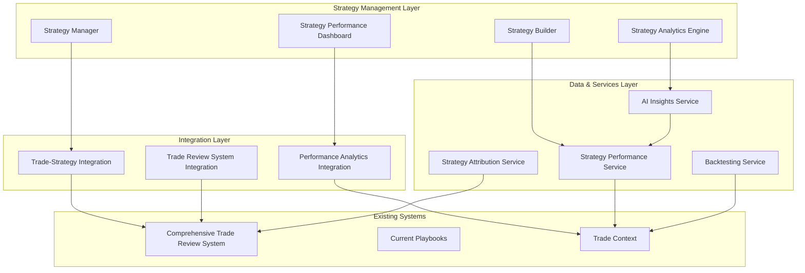

# Professional Strategy Management & Performance Analytics System - Design Document

## Overview

This design transforms the existing basic playbooks system into a professional-grade strategy management platform that serves as the central performance engine of the trading journal. The system builds upon the current `Playbooks.tsx` component while integrating seamlessly with the comprehensive trade review system to create an automated feedback loop that addresses the psychological barriers to consistent journaling.

The architecture follows the professional trading hierarchy: Trading Plan → Strategies (Enhanced Playbooks) → Individual Trades, where each level provides increasingly granular control and analysis capabilities.

## Architecture

### High-Level System Architecture



### Component Hierarchy Enhancement

```
EnhancedPlaybooks (replaces current Playbooks.tsx)
├── StrategyDashboard
│   ├── StrategyOverviewCards
│   │   ├── ProfessionalKPICard (Profit Factor, Expectancy, Sharpe)
│   │   ├── PerformanceIndicator
│   │   └── StatisticalSignificanceIndicator
│   ├── StrategyComparisonPanel
│   └── AIInsightsPanel
├── ProfessionalStrategyBuilder (enhanced creation form)
│   ├── MethodologySelector
│   ├── SetupConditionsBuilder
│   ├── EntryTriggersBuilder
│   ├── RiskManagementBuilder
│   │   ├── PositionSizingSelector
│   │   ├── StopLossRuleBuilder
│   │   └── TakeProfitRuleBuilder
│   └── BacktestingPanel
├── StrategyDetailView
│   ├── PerformanceAnalytics
│   │   ├── ProfessionalMetricsDisplay
│   │   ├── PerformanceCharts
│   │   └── TradeDistributionAnalysis
│   ├── TradeHistoryIntegration
│   │   ├── LinkedTradesView
│   │   └── TradeReviewSystemLinks
│   ├── PatternRecognitionInsights
│   └── BacktestingResults
└── StrategyMigrationWizard
    ├── DataPreservation
    ├── ProfessionalFieldCompletion
    └── ValidationGuidance
```

## Data Models

### Enhanced Strategy Interface

```typescript
// Enhanced version of current Playbook interface
interface ProfessionalStrategy {
  // Preserve existing basic fields
  id: string;
  title: string;
  description: string;
  color: string;
  
  // Legacy fields (preserved for migration)
  marketConditions?: string;
  entryParameters?: string;
  exitParameters?: string;
  
  // New professional structure
  methodology: 'Technical' | 'Fundamental' | 'Quantitative' | 'Hybrid';
  primaryTimeframe: string;
  assetClasses: string[];
  
  // Professional entry criteria (replaces entryParameters)
  setupConditions: {
    marketEnvironment: string;
    technicalConditions: string[];
    fundamentalConditions?: string[];
    volatilityRequirements?: string;
  };
  
  entryTriggers: {
    primarySignal: string;
    confirmationSignals: string[];
    timingCriteria: string;
  };
  
  // Professional exit criteria (replaces exitParameters)
  riskManagement: {
    positionSizingMethod: PositionSizingMethod;
    maxRiskPerTrade: number; // percentage
    stopLossRule: StopLossRule;
    takeProfitRule: TakeProfitRule;
    riskRewardRatio: number;
  };
  
  // Performance tracking
  performance: StrategyPerformance;
  
  // Metadata
  createdAt: string;
  updatedAt: string;
  lastUsed?: string;
  version: number;
  isActive: boolean;
}

interface PositionSizingMethod {
  type: 'FixedPercentage' | 'FixedDollar' | 'VolatilityBased' | 'KellyFormula';
  parameters: Record<string, any>;
}

interface StopLossRule {
  type: 'ATRBased' | 'PercentageBased' | 'StructureBased' | 'VolatilityBased';
  parameters: Record<string, any>;
  description: string;
}

interface TakeProfitRule {
  type: 'RiskRewardRatio' | 'StructureBased' | 'TrailingStop' | 'PartialTargets';
  parameters: Record<string, any>;
  description: string;
}
```

### Professional Performance Metrics

```typescript
interface StrategyPerformance {
  // Basic metrics (enhanced from current timesUsed, tradesWon, tradesLost)
  totalTrades: number;
  winningTrades: number;
  losingTrades: number;
  
  // Professional KPIs
  profitFactor: number; // Gross Profit / Gross Loss
  expectancy: number; // Average $ expected per trade
  winRate: number; // Percentage of winning trades
  averageWin: number;
  averageLoss: number;
  riskRewardRatio: number;
  
  // Risk-adjusted metrics
  sharpeRatio?: number;
  maxDrawdown: number;
  maxDrawdownDuration: number;
  
  // Statistical significance
  sampleSize: number;
  confidenceLevel: number;
  statisticallySignificant: boolean;
  
  // Performance over time
  monthlyReturns: MonthlyReturn[];
  performanceTrend: 'Improving' | 'Declining' | 'Stable' | 'Insufficient Data';
  
  // Last updated
  lastCalculated: string;
}

interface MonthlyReturn {
  month: string;
  return: number;
  trades: number;
  winRate: number;
}
```

### Integration with Trade Review System

```typescript
// Extension to existing Trade interface
interface TradeWithStrategy extends Trade {
  strategyId?: string;
  strategyName?: string;
  adherenceScore?: number; // How well trade followed strategy rules
  deviations?: StrategyDeviation[];
}

interface StrategyDeviation {
  type: 'EntryTiming' | 'PositionSize' | 'StopLoss' | 'TakeProfit' | 'RiskManagement';
  planned: any;
  actual: any;
  impact: 'Positive' | 'Negative' | 'Neutral';
  description: string;
}
```

## Components and Interfaces

### 1. EnhancedPlaybooks (Main Container)

**Purpose:** Replaces current `Playbooks.tsx` with professional strategy management capabilities.

```typescript
interface EnhancedPlaybooksProps {
  // Maintains compatibility with current usage
}

interface EnhancedPlaybooksState {
  strategies: ProfessionalStrategy[];
  selectedStrategy: ProfessionalStrategy | null;
  view: 'dashboard' | 'builder' | 'detail' | 'migration';
  migrationNeeded: boolean;
  performanceData: Map<string, StrategyPerformance>;
}
```

**Key Features:**
- Preserves existing UI patterns and navigation
- Adds professional dashboard view with KPI cards
- Integrates migration wizard for existing playbooks
- Provides strategy comparison and ranking

### 2. ProfessionalStrategyBuilder

**Purpose:** Enhanced creation/editing form with professional structure.

```typescript
interface ProfessionalStrategyBuilderProps {
  strategy?: ProfessionalStrategy;
  mode: 'create' | 'edit' | 'migrate';
  onSave: (strategy: ProfessionalStrategy) => void;
  onCancel: () => void;
}
```

**Key Features:**
- Guided wizard-style interface
- Separation of Setup vs Trigger conditions
- Professional risk management configuration
- Real-time validation and suggestions
- Integration with backtesting engine

### 3. StrategyPerformanceDashboard

**Purpose:** Professional KPI display with statistical significance indicators.

```typescript
interface StrategyPerformanceDashboardProps {
  strategies: ProfessionalStrategy[];
  selectedTimeframe: 'All' | '1M' | '3M' | '6M' | '1Y';
  sortBy: 'ProfitFactor' | 'Expectancy' | 'SharpeRatio' | 'WinRate';
}
```

**Key Features:**
- Professional KPI cards (Profit Factor, Expectancy, Sharpe Ratio)
- Statistical significance indicators
- Performance trend visualization
- Strategy ranking and comparison
- Integration with AI insights

### 4. TradeStrategyIntegration

**Purpose:** Seamless integration with comprehensive trade review system.

```typescript
interface TradeStrategyIntegrationProps {
  trade: Trade;
  availableStrategies: ProfessionalStrategy[];
  onStrategyAssignment: (tradeId: string, strategyId: string) => void;
  onPerformanceUpdate: (strategyId: string) => void;
}
```

**Key Features:**
- Automatic strategy suggestion based on trade characteristics
- Manual strategy assignment with validation
- Real-time performance metric updates
- Strategy adherence scoring
- Deviation tracking and analysis

## Service Layer Architecture

### 1. StrategyPerformanceService

**Purpose:** Calculates and maintains professional performance metrics.

```typescript
class StrategyPerformanceService {
  calculateProfessionalMetrics(
    strategyId: string, 
    trades: Trade[]
  ): StrategyPerformance;
  
  updatePerformanceMetrics(
    strategyId: string, 
    newTrade: Trade
  ): Promise<void>;
  
  calculateStatisticalSignificance(
    performance: StrategyPerformance
  ): boolean;
  
  generatePerformanceTrend(
    monthlyReturns: MonthlyReturn[]
  ): 'Improving' | 'Declining' | 'Stable' | 'Insufficient Data';
  
  compareStrategies(
    strategies: ProfessionalStrategy[]
  ): StrategyComparison[];
}
```

### 2. StrategyAttributionService

**Purpose:** Manages automatic trade-to-strategy matching and manual assignment.

```typescript
class StrategyAttributionService {
  suggestStrategy(
    trade: Trade, 
    strategies: ProfessionalStrategy[]
  ): StrategySuggestion[];
  
  assignTradeToStrategy(
    tradeId: string, 
    strategyId: string
  ): Promise<void>;
  
  calculateAdherenceScore(
    trade: Trade, 
    strategy: ProfessionalStrategy
  ): number;
  
  identifyDeviations(
    trade: Trade, 
    strategy: ProfessionalStrategy
  ): StrategyDeviation[];
  
  getUnassignedTrades(): Promise<Trade[]>;
}
```

### 3. AIInsightsService

**Purpose:** Generates actionable insights from strategy performance data.

```typescript
class AIInsightsService {
  generateStrategyInsights(
    strategy: ProfessionalStrategy,
    trades: Trade[]
  ): StrategyInsight[];
  
  identifyPerformancePatterns(
    strategies: ProfessionalStrategy[]
  ): PerformancePattern[];
  
  suggestOptimizations(
    strategy: ProfessionalStrategy
  ): OptimizationSuggestion[];
  
  detectMarketConditionCorrelations(
    strategyId: string
  ): MarketCorrelation[];
}

interface StrategyInsight {
  type: 'Performance' | 'Timing' | 'MarketCondition' | 'RiskManagement';
  message: string;
  confidence: number;
  actionable: boolean;
  supportingData: any;
}
```

### 4. BacktestingService

**Purpose:** Enables "what-if" analysis on historical trade data.

```typescript
class BacktestingService {
  runBacktest(
    strategy: ProfessionalStrategy,
    historicalTrades: Trade[],
    modifications?: StrategyModification[]
  ): BacktestResult;
  
  compareStrategyVersions(
    originalStrategy: ProfessionalStrategy,
    modifiedStrategy: ProfessionalStrategy,
    trades: Trade[]
  ): VersionComparison;
  
  simulateRiskManagementChanges(
    strategy: ProfessionalStrategy,
    newRiskParams: Partial<RiskManagement>
  ): SimulationResult;
}
```

## Integration Points

### 1. Trade Review System Integration

**Connection Points:**
- Strategy selection dropdown in trade review interface
- Automatic performance metric updates when trades are reviewed
- Strategy adherence scoring in trade analysis
- Direct links from strategy performance to individual trade reviews

**Data Flow:**
```
Trade Review System → Strategy Assignment → Performance Update → Dashboard Refresh
```

### 2. Migration from Current Playbooks

**Migration Strategy:**
1. **Data Preservation:** All existing playbook data is preserved
2. **Gradual Enhancement:** Users can continue using basic playbooks while gradually adding professional fields
3. **Guided Completion:** Migration wizard helps users complete professional structure
4. **Validation:** System validates professional fields and provides guidance

**Migration Mapping:**
```typescript
interface PlaybookMigration {
  preserveExisting: {
    id: string;
    title: string;
    description: string;
    color: string;
    timesUsed: number;
    tradesWon: number;
    tradesLost: number;
  };
  
  enhanceWith: {
    methodology: 'Technical'; // Default, user can change
    setupConditions: { marketEnvironment: marketConditions };
    entryTriggers: { primarySignal: entryParameters };
    riskManagement: { /* derived from exitParameters */ };
  };
  
  requireUserInput: [
    'primaryTimeframe',
    'positionSizingMethod',
    'riskRewardRatio'
  ];
}
```

## Error Handling and Validation

### Strategy Validation Rules

```typescript
interface StrategyValidation {
  required: {
    title: string;
    methodology: string;
    setupConditions: string;
    entryTriggers: string;
    riskManagement: RiskManagement;
  };
  
  businessRules: {
    maxRiskPerTrade: { min: 0.1, max: 10 }; // 0.1% to 10%
    riskRewardRatio: { min: 1, max: 10 };
    positionSizingMethod: 'must be defined';
  };
  
  warnings: {
    insufficientTrades: 'Need minimum 30 trades for statistical significance';
    highRisk: 'Risk per trade exceeds 5% - consider reducing';
    lowSampleSize: 'Performance metrics may not be reliable';
  };
}
```

### Performance Calculation Safeguards

```typescript
class PerformanceCalculationSafeguards {
  validateTradeData(trades: Trade[]): ValidationResult;
  handleMissingData(trades: Trade[]): Trade[];
  detectOutliers(trades: Trade[]): OutlierAnalysis;
  ensureStatisticalValidity(performance: StrategyPerformance): boolean;
}
```

## Performance Optimization

### Caching Strategy

```typescript
interface PerformanceCaching {
  strategyMetrics: {
    key: `strategy:${strategyId}:performance`;
    ttl: 300; // 5 minutes
    invalidateOn: ['trade_added', 'trade_updated', 'strategy_modified'];
  };
  
  aiInsights: {
    key: `strategy:${strategyId}:insights`;
    ttl: 3600; // 1 hour
    invalidateOn: ['significant_performance_change'];
  };
  
  backtestResults: {
    key: `backtest:${strategyId}:${hash}`;
    ttl: 86400; // 24 hours
    persistToDisk: true;
  };
}
```

### Lazy Loading Strategy

1. **Dashboard View:** Load strategy summaries first, detailed metrics on demand
2. **Performance Charts:** Load chart data when performance panel is expanded
3. **Trade History:** Paginate and virtualize large trade lists
4. **AI Insights:** Generate insights in background, show cached results immediately

## Security and Privacy

### Data Protection

```typescript
interface SecurityMeasures {
  strategyData: {
    encryption: 'AES-256';
    accessControl: 'user-specific';
    auditLog: 'all_modifications';
  };
  
  performanceMetrics: {
    anonymization: 'remove_dollar_amounts_for_sharing';
    aggregation: 'statistical_summaries_only';
  };
  
  aiInsights: {
    dataMinimization: 'pattern_analysis_only';
    noPersonalInfo: 'exclude_account_details';
  };
}
```

## Testing Strategy

### Unit Testing Focus Areas

1. **Performance Calculations:** Verify accuracy of all professional KPIs
2. **Strategy Attribution:** Test automatic matching algorithms
3. **Migration Logic:** Ensure data preservation during upgrades
4. **Validation Rules:** Test all business rule enforcement
5. **AI Insights:** Verify pattern recognition accuracy

### Integration Testing Scenarios

1. **Trade Review Integration:** Complete workflow from trade entry to strategy performance update
2. **Migration Workflow:** Full migration from basic playbook to professional strategy
3. **Performance Dashboard:** Real-time updates when new trades are added
4. **Backtesting Engine:** Accuracy of historical simulations

### Performance Testing

1. **Large Dataset Handling:** Test with 10,000+ trades across 50+ strategies
2. **Real-time Updates:** Measure performance metric calculation speed
3. **Dashboard Responsiveness:** Ensure smooth UI with complex analytics
4. **Memory Usage:** Monitor memory consumption during intensive calculations

## Accessibility and Mobile Considerations

### Accessibility Features

1. **Screen Reader Support:** Full ARIA labeling for complex performance charts
2. **Keyboard Navigation:** Complete keyboard accessibility for strategy builder
3. **High Contrast Mode:** Ensure performance indicators remain visible
4. **Color Blind Support:** Use patterns and text in addition to colors for KPIs

### Mobile Optimization

1. **Responsive Dashboard:** Collapsible KPI cards for mobile screens
2. **Touch-Friendly Builder:** Large touch targets for strategy configuration
3. **Simplified Mobile View:** Focus on essential metrics on small screens
4. **Offline Capability:** Cache strategy data for offline viewing

## Future Extensibility

### Planned Enhancements

1. **Advanced Backtesting:** Monte Carlo simulations and walk-forward analysis
2. **Market Regime Detection:** Automatic strategy recommendations based on market conditions
3. **Portfolio-Level Analytics:** Cross-strategy correlation and portfolio optimization
4. **Machine Learning Integration:** Predictive analytics for strategy performance
5. **API Integration:** Connect with external trading platforms and data providers

### Architecture Flexibility

The modular service-based architecture allows for easy extension:
- New performance metrics can be added to `StrategyPerformanceService`
- Additional AI insights can be integrated through `AIInsightsService`
- New backtesting algorithms can be plugged into `BacktestingService`
- External data sources can be integrated through dedicated adapter services