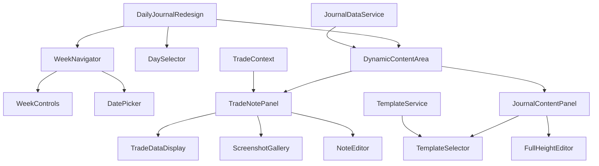

# Design Document

## Overview

The Daily Journal redesign creates a modern, calendar-based interface that transforms the journaling experience into an intuitive week-view layout with dynamic content areas. The design leverages existing calendar components, template systems, and trade integration patterns while introducing new navigation paradigms and adaptive content rendering based on entry types.

The system provides two distinct interaction modes: trade note reflection (with screenshot galleries and trade data integration) and full-day journaling (with extended content areas for comprehensive daily reflection). Both modes utilize the existing template infrastructure while offering specialized UI patterns optimized for their respective use cases.

## Steering Document Alignment

### Technical Standards (tech.md)

The design follows the established React + TypeScript architecture with component-based modularity. It leverages existing services (TradeContext, TemplateService, Firebase integration) and maintains the established patterns for real-time updates via WebSocket connections. The implementation will use the existing shadcn/ui component library for consistency and accessibility compliance.

Storage continues to use the hybrid localStorage + Firebase Firestore approach, with journal entries following the existing JournalEntry interface extensions. The design maintains the established 100ms response time for risk calculations and 500ms for data loading requirements.

### Project Structure (structure.md)

The implementation follows the established directory organization with new components placed in `src/components/journal/daily-journal/` for the main interface, extending the existing `src/components/journal/` structure. Template management builds upon the existing `src/services/TemplateService.ts`, and calendar components extend the established patterns in `design/CALENDAR/` prototypes.

The modular design principle is maintained with single-responsibility components, clear interface definitions, and separation of calendar navigation, content rendering, and template management concerns.

## Code Reuse Analysis

### Existing Components to Leverage

- **CalendarWidget (`src/components/CalendarWidget.tsx`)**: Base calendar navigation and date selection patterns, will be extended for week-view navigation
- **TemplateService (`src/services/TemplateService.ts`)**: Complete template CRUD operations and default template management
- **TradeContext (`src/contexts/TradeContext.tsx`)**: Trade data access and real-time updates for trade note integration
- **SectionEditor (`src/components/journal/SectionEditor.tsx`)**: Dynamic content rendering patterns based on section types
- **ImageManagementService (`src/services/ImageManagementService.ts`)**: Screenshot upload and management infrastructure
- **JournalDataService (`src/services/JournalDataService.ts`)**: Journal entry persistence and real-time synchronization

### Integration Points

- **TradeLog Integration**: Extend TradeLog components to include "View Notes" buttons and navigation hooks to Daily Journal
- **Firebase Storage**: Use existing screenshot storage patterns from `src/lib/screenshotStorage.ts` for trade note images
- **Journal Schema**: Extend existing `JournalEntry` interface to support trade note linking and dynamic content types
- **Navigation System**: Integrate with existing routing patterns for seamless TradeLog ↔ Daily Journal navigation

## Architecture

The architecture implements a hybrid calendar-journal interface with three main layers:

1. **Navigation Layer**: Week-based calendar navigation with quick date selection
2. **Content Layer**: Dynamic content areas that adapt based on entry type (trade notes vs daily journal)
3. **Integration Layer**: Bidirectional linking with TradeLog and template system integration

### Modular Design Principles

- **Single File Responsibility**: Calendar navigation, content rendering, and template management in separate components
- **Component Isolation**: WeekNavigator, DynamicContentArea, TradeNotePanel, and TemplateSelector as independent modules
- **Service Layer Separation**: Extend existing services rather than creating new data access patterns
- **Utility Modularity**: Date utilities, content type detection, and layout calculation helpers as focused modules



## Components and Interfaces

### WeekNavigator Component
- **Purpose:** Provides week-based navigation with current week, previous/next controls, and quick date selection
- **Interfaces:** 
  - `onWeekChange(startDate: Date, endDate: Date): void`
  - `onDateSelect(date: Date): void`
  - `currentWeek: { start: Date, end: Date }`
- **Dependencies:** Date manipulation utilities, calendar calculation helpers
- **Reuses:** Calendar animation patterns from `design/CALENDAR/trading-calendar-animated.tsx`

### DynamicContentArea Component
- **Purpose:** Renders different layouts based on entry type (trade notes vs daily journal entries)
- **Interfaces:**
  - `entryType: 'trade-note' | 'daily-journal'`
  - `selectedDate: Date`
  - `onContentChange(content: any): void`
- **Dependencies:** JournalDataService, TradeContext for trade data
- **Reuses:** Dynamic rendering patterns from `SectionEditor.tsx`

### TradeNotePanel Component
- **Purpose:** Specialized interface for trade-linked journal entries with trade data and screenshot support
- **Interfaces:**
  - `linkedTrade: Trade`
  - `journalEntry: JournalEntry`
  - `onImageUpload(file: File): Promise<void>`
- **Dependencies:** ImageManagementService, TradeContext
- **Reuses:** Screenshot management from `src/lib/screenshotStorage.ts`

### WeekBasedCalendar Component
- **Purpose:** Calendar widget optimized for week-view navigation with daily metrics overlay
- **Interfaces:**
  - `currentWeek: WeekRange`
  - `dailyMetrics: Map<string, DayMetrics>`
  - `onDaySelect(date: Date): void`
- **Dependencies:** Trading performance data, journal completion status
- **Reuses:** Calendar grid patterns from existing calendar components

### TradeLogIntegration Service
- **Purpose:** Manages bidirectional navigation and note linking between TradeLog and Daily Journal
- **Interfaces:**
  - `linkTradeToJournal(tradeId: string, journalEntryId: string): Promise<void>`
  - `getNotesForTrade(tradeId: string): Promise<JournalEntry | null>`
  - `navigateToTradeNotes(tradeId: string): void`
- **Dependencies:** TradeContext, JournalDataService, React Router
- **Reuses:** Existing navigation patterns and trade data structures

## Data Models

### WeekRange
```typescript
interface WeekRange {
  startDate: Date;          // Monday of the week
  endDate: Date;            // Friday of the week
  weekNumber: number;       // ISO week number
  year: number;             // Year for the week
}
```

### DayMetrics
```typescript
interface DayMetrics {
  date: string;             // YYYY-MM-DD format
  pnl: number;              // Daily P&L
  tradeCount: number;       // Number of trades
  winRate: number;          // Win rate percentage
  hasJournalEntry: boolean; // Journal entry exists
  hasTradeNotes: boolean;   // Trade notes exist
  completionPercentage: number; // Journal completion %
}
```

### TradeNoteEntry (extends JournalEntry)
```typescript
interface TradeNoteEntry extends JournalEntry {
  linkedTradeId: string;    // Reference to Trade.id
  tradeSnapshot: {          // Cached trade data for performance
    symbol: string;
    pnl: number;
    entryTime: string;
    strategy: string;
  };
  screenshots: ScreenshotAttachment[];
  analysisNotes: string;    // Reflective analysis text
}
```

### ScreenshotAttachment
```typescript
interface ScreenshotAttachment {
  id: string;               // Unique attachment ID
  fileName: string;         // Original file name
  fileSize: number;         // File size in bytes
  uploadedAt: Date;         // Upload timestamp
  firebaseUrl: string;      // Firebase Storage URL
  thumbnailUrl?: string;    // Optional thumbnail URL
  description?: string;     // User description
  timeframe?: string;       // Chart timeframe if applicable
}
```

## Error Handling

### Error Scenarios

1. **Navigation Failures**
   - **Handling:** Graceful fallback to current week view with error toast notification
   - **User Impact:** User sees current week with "Unable to load selected date" message

2. **Trade Data Loading Failures**
   - **Handling:** Show cached trade snapshot data with offline indicator
   - **User Impact:** Trade information displayed with "Data may be outdated" warning

3. **Image Upload Failures**
   - **Handling:** Retry mechanism with progressive backup (localStorage → Firebase)
   - **User Impact:** Upload progress with retry button and clear error messaging

4. **Template Loading Failures**
   - **Handling:** Fall back to basic text template with full functionality
   - **User Impact:** Simple editor interface with notification about template unavailability

5. **Week Data Loading Failures**
   - **Handling:** Show skeleton interface with cached data where available
   - **User Impact:** Partial interface with clear indicators of what data is missing

## Testing Strategy

### Unit Testing
- Component rendering with different entry types (trade notes vs daily journal)
- Date calculation utilities for week navigation and boundary handling
- Template application logic and content transformation
- Trade linking validation and data synchronization

### Integration Testing
- Navigation flow between TradeLog and Daily Journal
- Image upload pipeline from browser → Firebase Storage → journal entry
- Template selection and content population workflows
- Real-time data updates across calendar and content areas

### End-to-End Testing
- Complete trade note creation workflow from TradeLog navigation
- Week-by-week navigation with content loading and persistence
- Template customization and application across different entry types
- Mobile responsiveness and touch navigation (future consideration)


