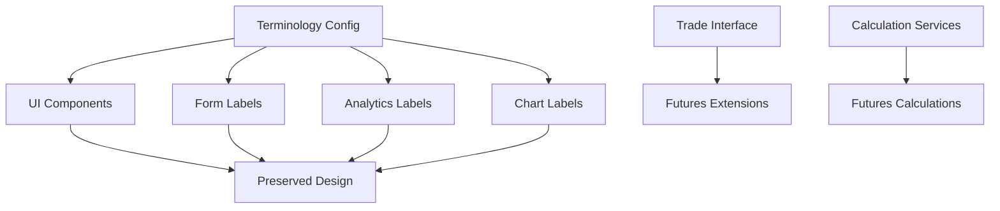

# Design Document

## Overview

This design document outlines the technical implementation for converting Zella Trade Scribe from forex-focused to futures-focused terminology and calculations while preserving the existing design, UI layout, and user experience. The conversion focuses on systematic replacement of forex-specific terms (pips, lots, currency pairs) with futures equivalents (points, contracts, futures instruments) through configuration-based changes and targeted code updates.

## Steering Document Alignment

### Technical Standards (tech.md)
The design follows the established TypeScript/React architecture with configuration-driven terminology changes. All existing components, services, and data models will be preserved with only terminology and calculation logic updated. The conversion maintains the existing localStorage-based data persistence and component-based UI patterns.

### Project Structure (structure.md)
The implementation will follow the established directory organization with terminology changes isolated in configuration files and utility functions. New terminology constants will be added to `src/lib/constants.ts` while existing components will be updated to use these constants instead of hardcoded strings.

## Code Reuse Analysis

### Existing Components to Leverage
- **All UI Components**: Preserve existing design and layout completely
- **Trade Interface**: Extend with optional futures-specific fields while maintaining backward compatibility
- **Analytics Components**: Reuse existing calculation patterns with updated terminology
- **Form Components**: Update labels and validation messages with futures terminology
- **Chart Components**: Maintain existing visualizations with updated axis labels and tooltips

### Integration Points
- **Trade Data Model**: Extend existing Trade interface with optional futures fields
- **Analytics Calculations**: Update existing performance calculations for futures markets
- **UI Labels**: Replace hardcoded forex terminology with configurable futures terms
- **Local Storage**: Maintain existing data structure with terminology updates

## Architecture

The design follows a configuration-driven approach that centralizes terminology changes while preserving all existing functionality and design patterns.

### Modular Design Principles
- **Single File Responsibility**: Terminology changes isolated in configuration files
- **Component Isolation**: Existing components updated to use terminology constants
- **Service Layer Separation**: Calculation services updated for futures markets
- **Utility Modularity**: Terminology utilities separated from business logic



## Components and Interfaces

### Component 1: Terminology Configuration System
- **Purpose:** Centralized management of all terminology changes from forex to futures
- **Interfaces:** `TerminologyConfig`, `getTerminology()`, `updateTerminology()`
- **Dependencies:** None - pure configuration
- **Reuses:** Existing component patterns for configuration management

### Component 2: Trade Data Model Extension
- **Purpose:** Extend existing Trade interface with optional futures-specific fields
- **Interfaces:** `FuturesTrade`, `ContractSpecification`, `PointValue`
- **Dependencies:** Existing Trade interface, terminology config
- **Reuses:** Existing trade data patterns and validation schemas

### Component 3: Calculation Service Updates
- **Purpose:** Update existing calculation services for futures-specific math
- **Interfaces:** `calculatePoints()`, `calculateContractValue()`, `calculateMargin()`
- **Dependencies:** Existing performance calculation services
- **Reuses:** Existing calculation patterns and caching mechanisms

### Component 4: UI Label Updates
- **Purpose:** Update all UI text to use futures terminology
- **Interfaces:** `FormLabels`, `AnalyticsLabels`, `ChartLabels`
- **Dependencies:** Terminology configuration, existing UI components
- **Reuses:** Existing form components, chart components, analytics displays

## Data Models

### Model 1: Terminology Configuration
```typescript
interface TerminologyConfig {
  // Basic terms
  pip: string; // "point"
  lot: string; // "contract"
  currencyPair: string; // "futures instrument"
  spread: string; // "bid-ask spread"
  leverage: string; // "margin requirement"
  
  // Calculated terms
  pipValue: string; // "point value"
  lotSize: string; // "contract size"
  lotType: string; // "contract type"
  
  // Display labels
  pipLabel: string; // "Points"
  lotLabel: string; // "Contracts"
  instrumentLabel: string; // "Futures Instrument"
}
```

### Model 2: Futures Trade Extension
```typescript
interface FuturesTrade extends Trade {
  // Optional futures-specific fields
  contractSize?: number;
  tickValue?: number;
  tickSize?: number;
  marginRequirement?: number;
  exchange?: string;
  contractMonth?: string;
  
  // Calculated fields
  totalValue?: number; // contractSize * entryPrice
  marginUsed?: number; // calculated from position size
  tickPnL?: number; // P&L in ticks/points
}
```

### Model 3: Contract Specification
```typescript
interface ContractSpecification {
  symbol: string;
  name: string;
  exchange: string;
  contractSize: number;
  tickValue: number;
  tickSize: number;
  marginRequirement: number;
  tradingHours: string;
  contractMonths: string[];
}
```

## Error Handling

### Error Scenarios
1. **Terminology Configuration Missing:** When terminology config is not loaded
   - **Handling:** Fall back to default forex terminology, log warning
   - **User Impact:** App functions normally with old terminology

2. **Futures Data Incomplete:** When futures-specific fields are missing
   - **Handling:** Use default values or calculate from available data
   - **User Impact:** App functions with available data, shows warnings for missing fields

3. **Calculation Errors:** When futures calculations fail
   - **Handling:** Fall back to existing calculations, log error
   - **User Impact:** App continues to function with basic calculations

4. **Data Migration Issues:** When converting existing trade data
   - **Handling:** Preserve original data, add new fields as optional
   - **User Impact:** No data loss, gradual migration as trades are updated

## Testing Strategy

### Unit Testing
- **Terminology Configuration:** Test all terminology mappings and fallbacks
- **Calculation Services:** Test futures calculations with various contract specifications
- **Data Migration:** Test conversion of existing trade data to new format
- **Component Updates:** Test UI components with new terminology

### Integration Testing
- **End-to-End Terminology:** Test complete app with futures terminology
- **Data Persistence:** Test saving and loading trades with futures data
- **Analytics Integration:** Test analytics calculations with futures terminology
- **Form Validation:** Test form validation with new field names

### End-to-End Testing
- **Complete User Workflow:** Test adding, editing, and viewing futures trades
- **Analytics Display:** Test all analytics views with futures terminology
- **Data Export:** Test exporting data with new terminology
- **Backward Compatibility:** Test existing data works with new terminology