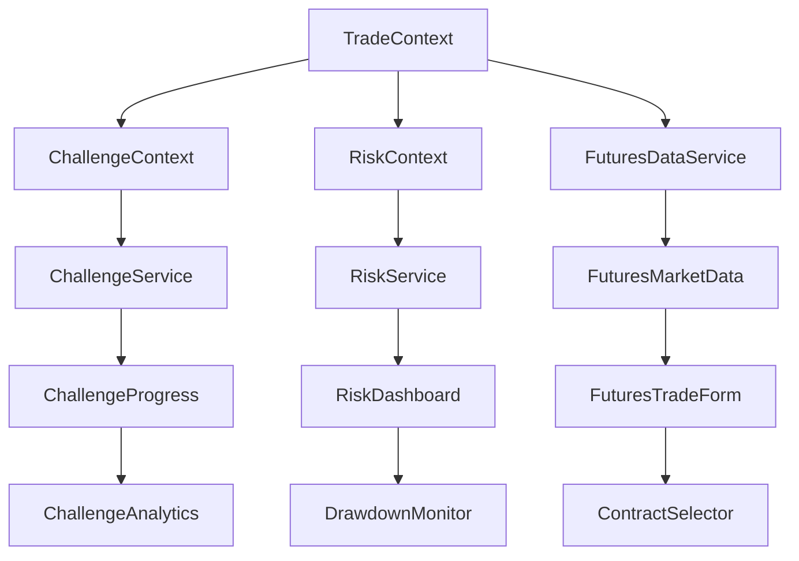

# Design Document

## Overview

This design document outlines the technical implementation for adding futures-specific features and prop firm challenge capabilities to Zella Trade Scribe. The enhancement builds upon the existing solid foundation of trade logging, performance analytics, and journal functionality while adding specialized modules for futures trading and prop firm challenge management. The design follows a modular approach that preserves existing functionality while enabling new features through optional add-ons.

## Steering Document Alignment

### Technical Standards (tech.md)
The design follows the established TypeScript/React architecture with component-based patterns, service layer separation, and localStorage-based data persistence. New features will integrate with existing contexts (TradeContext, AuthContext) while adding new specialized contexts (ChallengeContext, RiskContext) for prop firm and futures functionality.

### Project Structure (structure.md)
The implementation will follow the established directory organization with new modules in `src/components/futures/`, `src/components/prop-firm/`, and `src/components/risk-management/`. Services will be added to `src/services/` with clear separation between core trading logic and specialized futures/prop firm features.

## Code Reuse Analysis

### Existing Components to Leverage
- **TradeContext**: Extend with futures-specific trade data and challenge tracking
- **PerformanceAnalyticsService**: Reuse calculation patterns for challenge-specific metrics
- **AccessibleForm Components**: Leverage existing form patterns for challenge setup and futures trade entry
- **SmartAnalytics**: Extend with challenge progress tracking and risk monitoring
- **Trade Interface**: Extend with optional futures-specific fields while maintaining backward compatibility

### Integration Points
- **Trade Data Model**: Extend existing Trade interface with optional futures fields
- **Analytics Dashboard**: Add challenge progress widgets alongside existing performance metrics
- **Journal System**: Integrate challenge tracking with existing journal entries
- **Local Storage**: Extend existing data persistence with challenge and futures data

## Architecture

The design follows a modular architecture that extends the existing system without disrupting current functionality. New features are implemented as optional modules that can be enabled/disabled based on user preferences.

### Modular Design Principles
- **Single File Responsibility**: Each component handles either core trading logic OR specialized futures/prop firm features
- **Component Isolation**: Futures and prop firm features are isolated in dedicated modules
- **Service Layer Separation**: Business logic separated into specialized services (challengeService, riskService, futuresDataService)
- **Utility Modularity**: Futures-specific utilities are separate from core trading utilities



## Components and Interfaces

### Component 1: Challenge Management System
- **Purpose:** Manages prop firm challenge setup, progress tracking, and rule compliance
- **Interfaces:** `ChallengeContext`, `ChallengeService`, `ChallengeSetup`, `ChallengeProgress`
- **Dependencies:** TradeContext, localStorage, challenge rule engine
- **Reuses:** Existing form components, analytics patterns, data persistence layer

### Component 2: Futures Trading Enhancement
- **Purpose:** Adds futures-specific data fields and calculations to existing trade system
- **Interfaces:** `FuturesTradeForm`, `ContractSelector`, `MarginCalculator`, `FuturesDataService`
- **Dependencies:** Trade interface, market data APIs, contract specifications
- **Reuses:** Existing trade form patterns, validation schemas, data models

### Component 3: Risk Management Dashboard
- **Purpose:** Real-time risk monitoring and drawdown tracking for prop firm challenges
- **Interfaces:** `RiskDashboard`, `DrawdownMonitor`, `RiskAlerts`, `RiskService`
- **Dependencies:** Challenge data, trade data, real-time calculations
- **Reuses:** Existing analytics components, chart libraries, notification patterns

### Component 4: Challenge Analytics
- **Purpose:** Specialized analytics for prop firm challenge progress and performance
- **Interfaces:** `ChallengeAnalytics`, `ProgressTracker`, `CompletionReport`
- **Dependencies:** Challenge data, trade performance, analytics service
- **Reuses:** Existing analytics service, chart components, performance calculations

## Data Models

### Model 1: Challenge
```typescript
interface Challenge {
  id: string;
  name: string;
  propFirm: string;
  accountSize: number;
  profitTarget: number;
  dailyDrawdownLimit: number;
  overallDrawdownLimit: number;
  minimumTradingDays: number;
  maximumTradingDays: number;
  startDate: string;
  endDate?: string;
  status: 'active' | 'completed' | 'failed' | 'paused';
  currentPnL: number;
  currentDrawdown: number;
  tradingDays: number;
  rules: ChallengeRule[];
  createdAt: string;
  updatedAt: string;
}
```

### Model 2: Futures Trade Extension
```typescript
interface FuturesTrade extends Trade {
  // Futures-specific fields (optional)
  contractSize?: number;
  tickValue?: number;
  tickSize?: number;
  marginRequirement?: number;
  exchange?: string;
  contractMonth?: string;
  settlementPrice?: number;
  openInterest?: number;
  volume?: number;
  // Calculated fields
  totalValue?: number; // contractSize * entryPrice
  marginUsed?: number; // calculated from position size
  tickPnL?: number; // P&L in ticks
}
```

### Model 3: Risk Metrics
```typescript
interface RiskMetrics {
  challengeId: string;
  currentDrawdown: number;
  dailyDrawdown: number;
  overallDrawdown: number;
  remainingRisk: number;
  riskCapacity: number;
  positionRisk: number;
  maxPositionSize: number;
  lastUpdated: string;
  alerts: RiskAlert[];
}
```

### Model 4: Challenge Rule
```typescript
interface ChallengeRule {
  id: string;
  type: 'trading_hours' | 'position_size' | 'overnight_positions' | 'news_trading' | 'max_daily_loss';
  description: string;
  parameters: Record<string, any>;
  isActive: boolean;
  violationCount: number;
  lastViolation?: string;
}
```

## Error Handling

### Error Scenarios
1. **Challenge Rule Violation:** When user attempts to place trade that violates challenge rules
   - **Handling:** Prevent trade execution, show specific violation message, log violation
   - **User Impact:** Trade blocked with clear explanation of rule violation

2. **Drawdown Limit Exceeded:** When current drawdown approaches or exceeds limits
   - **Handling:** Show warning alerts, prevent new trades if limit exceeded, suggest position reduction
   - **User Impact:** Visual alerts, trade restrictions, risk management suggestions

3. **Market Data Unavailable:** When futures market data API is down
   - **Handling:** Use cached data, show offline indicator, gracefully degrade functionality
   - **User Impact:** Limited real-time features, cached data display, offline mode indicator

4. **Challenge Completion/Failure:** When challenge objectives are met or failed
   - **Handling:** Update challenge status, generate completion report, lock account if failed
   - **User Impact:** Status notification, detailed report, account access changes

## Testing Strategy

### Unit Testing
- **Challenge Service:** Test rule validation, progress calculations, status updates
- **Risk Service:** Test drawdown calculations, risk capacity calculations, alert triggers
- **Futures Data Service:** Test contract specifications, margin calculations, P&L calculations
- **Component Logic:** Test form validation, data transformation, user interactions

### Integration Testing
- **Challenge-Trade Integration:** Test how challenges affect trade entry and validation
- **Risk-Trade Integration:** Test real-time risk updates when trades are added/modified
- **Analytics Integration:** Test challenge metrics integration with existing analytics
- **Data Persistence:** Test challenge and futures data storage and retrieval

### End-to-End Testing
- **Challenge Setup Flow:** Complete challenge creation and configuration process
- **Trading with Challenges:** Place trades while challenge rules are active
- **Risk Monitoring:** Test real-time risk dashboard and alert system
- **Challenge Completion:** Test challenge pass/fail scenarios and reporting