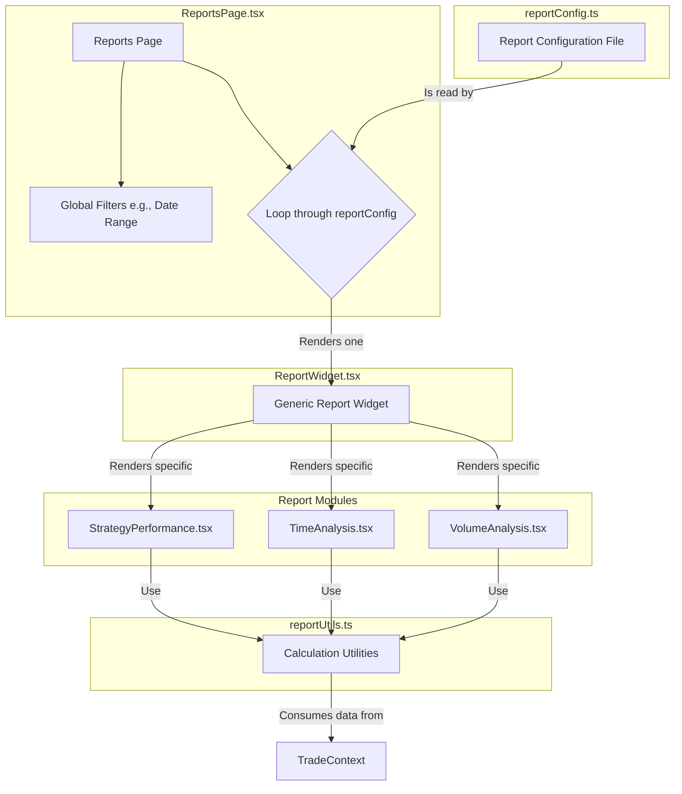

# Design Document

## Overview

This document details the technical design for the "Trading Performance Reports" page. The feature will be a modular, dashboard-style page composed of individual "report widgets". This architecture ensures scalability and maintainability, allowing new reports to be added in the future with minimal effort. The page will provide traders with visual and statistical analysis of their performance.

## Steering Document Alignment

### Technical Standards (tech.md)
The design adheres to the established technical standards. It will be built using **TypeScript**, **React 18**, and **Vite**. The UI will be constructed with **shadcn/ui** components, and data visualizations will be rendered using **Recharts**. State management will leverage the existing **React Context API** (`TradeContext`).

### Project Structure (structure.md)
The implementation will follow the project's defined structure. New files will be organized as follows:
- `src/pages/ReportsPage.tsx`: The main view layer component.
- `src/components/reports/`: A new subdirectory for all report-related components (e.g., `ReportWidget.tsx`, `StrategyPerformance.tsx`).
- `src/config/reports.ts`: The central configuration file for defining available reports.
- `src/utils/reportUtils.ts`: Utility functions for report calculations.

## Code Reuse Analysis

This feature will leverage several existing parts of the codebase to ensure consistency and reduce redundant code.

### Existing Components to Leverage
- **`useTradeContext` hook**: This will be the primary source of trade data for all report calculations.
- **`shadcn/ui` Components**: We will extensively use existing UI components like `Card`, `Tabs`, `Button`, and `Select` to build the UI, ensuring visual consistency with the rest of the application.
- **`Recharts` library**: The existing data visualization library will be used for all charts and graphs.

### Integration Points
- **`TradeContext`**: The reports page will be a consumer of the global `TradeContext`, reading the list of trades to perform its analysis. It will not modify the context.
- **React Router**: A new route (`/reports`) will be added to the application's router to render the `ReportsPage` component.

## Architecture

The reports page will be built on a modular, configuration-driven, widget-based architecture. This design promotes separation of concerns and makes the system highly extensible.

### Modular Design Principles
- **Single File Responsibility**: The `ReportsPage` is only a container. `ReportWidget` handles rendering. Each specific report component (e.g., `StrategyPerformance`) handles its own logic and presentation. `reportUtils.ts` handles only data calculation.
- **Component Isolation**: Each report widget is a self-contained unit.
- **Service Layer Separation**: Data is provided by the `TradeContext`. Calculation logic is in `reportUtils.ts`. Presentation is handled by the components.

## Components and Interfaces

### `ReportsPage.tsx`
- **Purpose:** Acts as the main container for the reports dashboard. Renders the page title, global filters, and a grid of `ReportWidget` components based on the central configuration.
- **Interfaces:** None (page-level component).
- **Dependencies:** `reportConfig.ts`, `ReportWidget.tsx`, `useTradeContext`.
- **Reuses:** `shadcn/ui` for layout.

### `ReportWidget.tsx`
- **Purpose:** A generic wrapper component that renders a specific report. It will handle common elements like the card container, title, loading states, and error states.
- **Interfaces:** `Props { reportId: string; }`
- **Dependencies:** `reportConfig.ts`, specific report components.
- **Reuses:** `Card` component from `shadcn/ui`.

### `StrategyPerformance.tsx`
- **Purpose:** Displays the "Performance by Strategy" report, including a bar chart and summary table.
- **Interfaces:** None (internal component).
- **Dependencies:** `reportUtils.ts`, `Recharts`.
- **Reuses:** `shadcn/ui` components.

### `TimeAnalysis.tsx`
- **Purpose:** Displays the "Performance by Time" report with controls to switch between session and hourly views.
- **Interfaces:** None (internal component).
- **Dependencies:** `reportUtils.ts`, `Recharts`.
- **Reuses:** `Tabs` component from `shadcn/ui`.

### `VolumeAnalysis.tsx`
- **Purpose:** Displays the "Volume & Sizing" report with stat cards and a histogram.
- **Interfaces:** None (internal component).
- **Dependencies:** `reportUtils.ts`, `Recharts`.
- **Reuses:** `shadcn/ui` components.

## Data Models

No new data models will be created for this feature. All reports will be generated by processing the existing `Trade` model, which is defined in `src/types/trade.ts`.

## Error Handling

### Error Scenarios
1. **Scenario 1:** User has no trade data.
   - **Handling:** The `ReportsPage` will detect that the trade list from `useTradeContext` is empty.
   - **User Impact:** The page will render the "Empty State" component, which displays a helpful message guiding the user to add trades.
2. **Scenario 2:** A report widget fails to render due to a calculation error.
   - **Handling:** The `ReportWidget` component will be wrapped in an Error Boundary.
   - **User Impact:** The specific widget that fails will display an error message, while the rest of the reports on the page will continue to function normally.

## Testing Strategy

### Unit Testing
- The `reportUtils.ts` file will have comprehensive unit tests for all calculation functions (`calculateStrategyPerformance`, `analyzeTradingTimes`, etc.). We will use mock trade data to cover various scenarios and edge cases.

### Integration Testing
- Each report widget component (`StrategyPerformance.tsx`, etc.) will be tested to ensure it correctly renders the data provided by the calculation utils and that user interactions (like toggling views) work as expected.

### End-to-End Testing
- A test scenario will be created to simulate a user navigating to the reports page, interacting with the date filter, and viewing the rendered reports to ensure the entire flow works correctly.