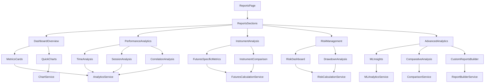

# Design Document

## Overview

The Reports Page Revamp transforms the existing basic reports functionality into a comprehensive analytics platform that provides futures traders and prop firm challenge participants with institutional-grade insights. This redesign leverages existing components while introducing advanced analytics capabilities including machine learning insights, Monte Carlo simulations, and responsive custom report builders.

The new reports page will serve as the analytical nerve center of the trading journal, providing actionable insights through advanced data visualization, statistical analysis, and pattern discovery to help users improve their trading performance and achieve prop firm funding success.

## Steering Document Alignment

### Technical Standards (tech.md)
- **React 18 with TypeScript**: Leveraging concurrent features and strong typing for complex analytics calculations
- **Component-Based Architecture**: Modular report components with clear separation of concerns between data processing, visualization, and UI layers
- **Recharts Integration**: Extending existing chart infrastructure for advanced visualizations
- **Performance Optimization**: Using web workers for heavy calculations, implementing progressive loading, and maintaining 60fps chart rendering
- **Real-time Updates**: WebSocket integration for live market data and risk monitoring
- **Responsive Design**: Mobile-first approach adapting to desktop, tablet, and large mobile displays

### Project Structure (structure.md)
- **Modular Organization**: Following established patterns in `src/components/reports/` with dedicated subdirectories for analytics modules
- **Service Layer Separation**: Analytics services in `src/services/analytics/` separate from presentation components
- **Type Definitions**: Comprehensive TypeScript interfaces in `src/types/analytics/` for all new data models
- **Hook-Based Logic**: Custom hooks in `src/hooks/analytics/` for state management and data processing
- **Utility Functions**: Calculation utilities in `src/utils/analytics/` for reusable mathematical operations

## Code Reuse Analysis

### Existing Components to Leverage
- **ReportWidget.tsx**: Base component for rendering individual report sections - will be extended with new analytics widgets
- **Chart Components**: Existing Recharts infrastructure (`ChartContainer`, `ChartTooltip`, `OptimizedChart`) for performance optimizations
- **TradeContext**: Current trade data management - will be enhanced with analytics caching
- **Card Components**: shadcn/ui card system for consistent report section layouts
- **Export Services**: Existing `StrategyExportService` for PDF/Excel generation - will be extended for advanced reports
- **Date Filtering**: Current date range functionality in ReportsPage - will be enhanced with session-based filtering

### Integration Points
- **Trade Data Model**: Extend existing `Trade` interface with analytics-specific calculated fields
- **Local Storage**: Leverage existing offline-first strategy for analytics preferences and cached calculations
- **Report Configuration**: Extend existing `reports.ts` config system for new analytics modules
- **Theme System**: Integrate with existing dark mode and styling patterns
- **Authentication Context**: Use existing user context for personalized analytics and preferences

## Architecture

The reports revamp follows a layered architecture with clear separation of concerns:

### Modular Design Principles
- **Analytics Engine Layer**: Dedicated services for calculations, pattern recognition, and statistical analysis
- **Visualization Layer**: Reusable chart components optimized for different data types and use cases
- **Configuration Layer**: Flexible report builder system supporting custom layouts and metrics
- **Caching Layer**: Intelligent caching for expensive calculations and real-time data updates
- **Export Layer**: Enhanced export system supporting multiple formats and custom templates



## Components and Interfaces

### Core Analytics Components

#### ReportsPageRevamped
- **Purpose:** Main orchestrator component managing section navigation, global filters, and state
- **Interfaces:** 
  - `ReportsPageState`: Global state management
  - `FilterConfig`: Date ranges, account selection, instrument filtering
  - `ExportOptions`: PDF/Excel generation options
- **Dependencies:** TradeContext, AnalyticsProvider, ReportConfigProvider
- **Reuses:** Existing ReportWidget pattern, Card components, Button/Select from shadcn/ui

#### DashboardOverviewSection
- **Purpose:** High-level performance summary with key metrics and challenge-specific data
- **Interfaces:**
  - `DashboardMetrics`: Win rate, profit factor, Sharpe ratio, drawdown metrics
  - `ChallengeStatus`: Progress tracking, rule compliance, target achievement
  - `QuickChartData`: Equity curve, monthly P&L, distribution data
- **Dependencies:** AnalyticsService, ChallengCalculationService
- **Reuses:** Existing MetricCard components, chart infrastructure

#### PerformanceAnalyticsSection
- **Purpose:** Deep-dive performance analysis across time dimensions and correlations
- **Interfaces:**
  - `TimeBasedAnalytics`: Hourly, daily, session-based performance data
  - `CorrelationMatrix`: Position size vs P&L, hold time vs profitability correlations
  - `DistributionData`: P&L, R-multiple, win/loss streak distributions
- **Dependencies:** TimeAnalysisService, CorrelationService, StatisticalService
- **Reuses:** Existing TimeAnalysis component, OptimizedChart components

#### InstrumentAnalysisSection
- **Purpose:** Futures-specific contract analysis and cross-instrument comparisons
- **Interfaces:**
  - `ContractMetrics`: Tick-based calculations, margin efficiency, volume patterns
  - `InstrumentComparison`: Performance matrices, correlation analysis
  - `FuturesSpecificData`: Exchange-specific data, contract size optimization
- **Dependencies:** FuturesCalculationService, InstrumentComparisonService
- **Reuses:** Existing volume analysis patterns, comparison utilities

#### AdvancedAnalyticsSection
- **Purpose:** Machine learning insights, comparative analysis, and custom report building
- **Interfaces:**
  - `MLInsights`: Predictive patterns, leading indicators, strategy recommendations
  - `ComparativeData`: Multi-account analysis, benchmark comparisons
  - `CustomReportConfig`: User-defined metrics, layout configurations
- **Dependencies:** MLAnalyticsService, ComparisonService, ReportBuilderService
- **Reuses:** Existing export infrastructure, template system

### Supporting Services

#### AnalyticsService
- **Purpose:** Core analytics calculations and data processing engine
- **Interfaces:**
  - `calculatePerformanceMetrics(trades: Trade[]): PerformanceMetrics`
  - `generateTimeAnalysis(trades: Trade[], period: TimePeriod): TimeAnalysis`
  - `computeCorrelations(trades: Trade[]): CorrelationMatrix`
- **Dependencies:** StatisticalUtils, CacheService, WebWorkerPool
- **Reuses:** Existing trade filtering utilities, calculation patterns

#### MLAnalyticsService
- **Purpose:** Machine learning insights and predictive analytics (API-dependent)
- **Interfaces:**
  - `identifyPatterns(trades: Trade[]): PatternInsights`
  - `generatePredictions(data: AnalyticsData): PredictiveInsights`
  - `recommendOptimizations(metrics: PerformanceMetrics): Recommendations`
- **Dependencies:** External ML API (TBD), PatternRecognitionService
- **Reuses:** Existing pattern recognition infrastructure

#### ReportBuilderService
- **Purpose:** Custom report creation and template management
- **Interfaces:**
  - `createCustomReport(config: ReportConfig): CustomReport`
  - `saveTemplate(template: ReportTemplate): void`
  - `generateScheduledReport(schedule: ReportSchedule): void`
- **Dependencies:** TemplateEngine, ExportService, StorageService
- **Reuses:** Existing StrategyExportService patterns, template infrastructure

## Data Models

### Core Analytics Types

#### PerformanceMetrics
```typescript
interface PerformanceMetrics {
  // Basic Metrics
  totalTrades: number;
  winRate: number;
  profitFactor: number;
  averageRMultiple: number;
  sharpeRatio: number;
  
  // Drawdown Analysis
  maxDrawdown: number;
  maxDrawdownPercent: number;
  currentDrawdown: number;
  recoveryTime: number;
  
  // Risk Metrics
  averageRisk: number;
  riskConsistency: number;
  marginEfficiency: number;
  
  // Challenge-Specific
  challengeProgress?: ChallengeMetrics;
  ruleCompliance?: ComplianceStatus;
}
```

#### TimeBasedAnalytics
```typescript
interface TimeBasedAnalytics {
  // Calendar Data
  dailyHeatmap: DailyPerformanceData[];
  
  // Session Analysis
  sessionPerformance: {
    asian: SessionMetrics;
    european: SessionMetrics;
    us: SessionMetrics;
    overlap: SessionMetrics;
  };
  
  // Hourly Patterns
  hourlyPerformance: HourlyData[];
  
  // Seasonal Effects
  monthlyPatterns: MonthlyData[];
  quarterlyTrends: QuarterlyData[];
}
```

#### InstrumentAnalytics
```typescript
interface InstrumentAnalytics {
  // Contract-Specific
  contractMetrics: Map<string, ContractPerformance>;
  
  // Cross-Instrument Analysis
  correlationMatrix: InstrumentCorrelation[][];
  performanceRanking: InstrumentRanking[];
  
  // Futures-Specific
  marginEfficiency: Map<string, number>;
  tickValueOptimization: Map<string, OptimalSizing>;
  exchangeComparison: ExchangeMetrics[];
}
```

#### MLInsights
```typescript
interface MLInsights {
  // Pattern Recognition
  identifiedPatterns: TradingPattern[];
  patternEffectiveness: PatternMetrics[];
  
  // Predictive Analytics
  leadingIndicators: IndicatorData[];
  successProbability: number;
  
  // Recommendations
  strategyOptimizations: StrategyRecommendation[];
  riskAdjustments: RiskRecommendation[];
  
  // Note: Implementation pending API provider selection
  apiStatus: 'pending' | 'available' | 'error';
}
```

#### CustomReportConfig
```typescript
interface CustomReportConfig {
  id: string;
  name: string;
  sections: ReportSection[];
  layout: LayoutConfig;
  filters: FilterConfig;
  scheduling?: ScheduleConfig;
  
  // Responsive Design
  responsiveBreakpoints: {
    mobile: LayoutConfig;
    tablet: LayoutConfig;
    desktop: LayoutConfig;
  };
}
```

## Error Handling

### Error Scenarios

1. **Calculation Failures**
   - **Handling:** Graceful degradation with partial data display, error boundaries for section isolation
   - **User Impact:** Warning messages with available data shown, suggestions for data requirements

2. **ML API Unavailability**
   - **Handling:** Fallback to basic pattern recognition, cached insights when available
   - **User Impact:** Clear indication of limited functionality, option to configure API provider

3. **Large Dataset Performance Issues**
   - **Handling:** Progressive loading, web worker utilization, data pagination
   - **User Impact:** Loading indicators, option to reduce dataset size or apply filters

4. **Export Generation Failures**
   - **Handling:** Retry mechanism, partial export options, format fallbacks
   - **User Impact:** Clear error messages, alternative export formats offered

5. **Real-time Data Connection Loss**
   - **Handling:** Offline mode with cached data, reconnection attempts
   - **User Impact:** Visual indicators of connection status, manual refresh option

## Testing Strategy

### Unit Testing
- **Analytics Services**: Test calculation accuracy with known datasets, edge case handling
- **Chart Components**: Test data transformation, responsive behavior, performance optimization
- **Report Builder**: Test template generation, custom metric calculations, export functionality
- **ML Integration**: Mock API responses, test fallback behavior, error handling

### Integration Testing
- **Data Flow**: Test complete analytics pipeline from trade data to visualizations
- **Export Workflows**: Test PDF/Excel generation with complex reports and custom templates
- **Real-time Updates**: Test WebSocket integration and cache invalidation
- **Cross-component Communication**: Test filter propagation and state synchronization

### End-to-End Testing
- **User Scenarios**: Complete report generation workflow, custom report creation, scheduled exports
- **Performance Testing**: Large dataset handling (10,000+ trades), concurrent user simulation
- **Responsive Testing**: Cross-device functionality, touch interactions, layout adaptations
- **Accessibility Testing**: Screen reader compatibility, keyboard navigation, color contrast

### Performance Testing
- **Calculation Benchmarks**: Analytics processing time targets (< 2 seconds for 10,000 trades)
- **Chart Rendering**: 60fps maintenance with interactive elements and animations
- **Memory Management**: < 150MB memory usage with large datasets and multiple visualizations
- **Network Optimization**: Efficient data loading patterns and caching strategies