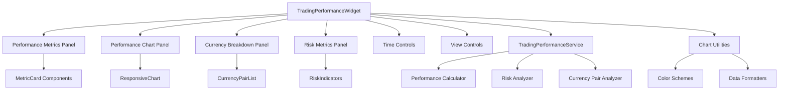

# Design Document

## Overview

The Trading Performance Widget is a comprehensive dashboard component that consolidates key performance metrics, visual analytics, and forex-specific insights into an attractive, interactive widget. Building upon the existing widget architecture, this component will provide professional-grade performance visualization with responsive design and seamless integration into the current dashboard ecosystem.

## Steering Document Alignment

### Technical Standards (tech.md)

- **React 18 + TypeScript**: Component built with modern React patterns and full TypeScript support
- **Recharts Integration**: Leveraging existing chart infrastructure for consistency
- **shadcn/ui Components**: Using established UI component library (Card, Button, Badge, Select)
- **Tailwind CSS**: Following existing styling patterns and responsive design principles
- **Service Layer Architecture**: Separating data logic from presentation via dedicated services
- **Modular Architecture**: Component designed as self-contained, reusable unit

### Project Structure (structure.md)

- **Component Location**: `src/components/TradingPerformanceWidget.tsx`
- **Service Integration**: Leveraging existing `performanceAnalyticsService` and creating `tradingPerformanceService`
- **Type Definitions**: Extending `src/types/widget.ts` and `src/types/trade.ts`
- **Widget Registry**: Integration with `src/lib/widgetRegistry.tsx`
- **Naming Conventions**: Following PascalCase for components, camelCase for services

## Code Reuse Analysis

### Existing Components to Leverage

- **PerformanceChartWidget.tsx**: Chart rendering patterns, time range selection, responsive container setup
- **SetupAnalyticsWidget.tsx**: Multi-view tabs, filtering controls, professional chart configurations
- **Card, CardContent, CardHeader, CardTitle**: Consistent widget container structure
- **ChartContainer, ChartTooltip**: Standardized chart wrapping and tooltip formatting
- **ResponsiveContainer, AreaChart, BarChart, LineChart**: Recharts components with established styling
- **Button, Badge, Select**: UI controls following design system patterns

### Integration Points

- **Widget Registry**: Register as new widget with category 'performance', defaultLayout: { w: 8, h: 5 }
- **Dashboard Integration**: Seamless integration with existing dashboard layout system
- **Trade Data Service**: Connect to existing trade data pipeline via Trade[] interface
- **Performance Analytics**: Extend existing performance calculation services
- **Responsive Grid**: Utilize existing responsive widget sizing system

## Architecture

### Modular Design Principles
- **Single File Responsibility**: Main widget component focuses solely on performance visualization
- **Component Isolation**: Sub-components for metrics display, charts, and controls are independently testable
- **Service Layer Separation**: Data calculations and transformations handled in dedicated service layer
- **Utility Modularity**: Chart utilities, color schemes, and formatters in separate utility modules



## Components and Interfaces

### TradingPerformanceWidget (Main Component)
- **Purpose:** Main container component orchestrating all performance displays
- **Interfaces:** 
  - Props: `{ trades: Trade[], size: { w: number, h: number } }`
  - State: `{ timeRange, viewMode, selectedPair, isLoading }`
- **Dependencies:** TradingPerformanceService, Chart utilities, UI components
- **Reuses:** Card structure from existing widgets, ChartContainer patterns

### PerformanceMetricsPanel
- **Purpose:** Display key performance indicators in compact metric cards
- **Interfaces:** 
  - Props: `{ metrics: PerformanceMetrics, timeRange: string }`
  - Renders: P&L, Win Rate, Avg Pip Gain/Loss, Risk-Reward Ratio
- **Dependencies:** MetricCard components, formatting utilities
- **Reuses:** MetricWidgetLayout pattern from existing widgets

### PerformanceChartPanel
- **Purpose:** Interactive chart showing cumulative P&L trends with hover details
- **Interfaces:**
  - Props: `{ data: ChartDataPoint[], timeRange: string, height: number }`
  - Events: onHover, onTimeRangeChange
- **Dependencies:** Recharts, ChartContainer, gradient definitions
- **Reuses:** AreaChart patterns, tooltip configurations, responsive container

### CurrencyPairBreakdown
- **Purpose:** Shows top performing and worst performing currency pairs
- **Interfaces:**
  - Props: `{ pairData: CurrencyPairMetrics[], onPairClick: (pair: string) => void }`
  - Renders: Top 3 best/worst pairs with performance indicators
- **Dependencies:** Badge components, color coding utilities
- **Reuses:** List rendering patterns from RecentTradesWidget

### RiskMetricsDisplay
- **Purpose:** Display drawdown, max drawdown, and risk indicators with visual warnings
- **Interfaces:**
  - Props: `{ riskData: RiskMetrics, thresholds: RiskThresholds }`
  - Renders: Risk indicators with color-coded warning states
- **Dependencies:** Badge, trend indicators, warning utilities
- **Reuses:** Color-coded metric patterns from existing widgets

### InteractiveControls
- **Purpose:** Time period selectors and metric toggle controls
- **Interfaces:**
  - Props: `{ onTimeChange, onViewChange, availableOptions }`
  - Events: Time range selection, metric visibility toggles
- **Dependencies:** Select, Button components
- **Reuses:** Time range selector from PerformanceChartWidget

## Data Models

### PerformanceMetrics
```typescript
interface PerformanceMetrics {
  totalPnL: number;
  winRate: number;
  totalTrades: number;
  avgPipGain: number;
  avgPipLoss: number;
  riskRewardRatio: number;
  currentDrawdown: number;
  maxDrawdown: number;
  profitFactor: number;
  sharpeRatio?: number;
}
```

### ChartDataPoint
```typescript
interface ChartDataPoint {
  date: string;
  cumulativePnL: number;
  dailyPnL: number;
  tradeCount: number;
  timestamp: number;
}
```

### CurrencyPairMetrics
```typescript
interface CurrencyPairMetrics {
  pair: string;
  totalPnL: number;
  tradeCount: number;
  winRate: number;
  avgPips: number;
  rank: 'best' | 'worst';
}
```

### RiskMetrics
```typescript
interface RiskMetrics {
  currentDrawdown: number;
  maxDrawdown: number;
  drawdownPercent: number;
  riskRewardRatio: number;
  consecutiveLosses: number;
  isAtRiskThreshold: boolean;
}
```

## Error Handling

### Error Scenarios
1. **No Trade Data Available**
   - **Handling:** Display empty state with explanatory message and suggested actions
   - **User Impact:** Clear guidance on getting started with trade logging

2. **Insufficient Data for Time Range**
   - **Handling:** Show partial data with notification about limited data availability
   - **User Impact:** User understands data limitations and can adjust time range

3. **Chart Rendering Failures**
   - **Handling:** Graceful fallback to table format with error boundary
   - **User Impact:** Data remains accessible even if visualizations fail

4. **Performance Calculation Errors**
   - **Handling:** Display last known good values with error indicator
   - **User Impact:** Minimal disruption to workflow with clear error communication

## Testing Strategy

### Unit Testing
- **Component Rendering**: Test all visual states including loading, error, and data states
- **Data Transformations**: Test performance calculations, currency pair analysis, risk metrics
- **User Interactions**: Test time range changes, view mode switches, currency pair clicks
- **Edge Cases**: Empty data, single trade, extreme values, negative performance

### Integration Testing
- **Widget Registry Integration**: Test proper registration and dashboard integration
- **Data Service Integration**: Test real trade data processing and metric calculations
- **Responsive Behavior**: Test component behavior across different widget sizes
- **Theme Integration**: Test dark/light mode compatibility

### End-to-End Testing
- **Dashboard Workflow**: Test widget addition, removal, and resizing within dashboard
- **Performance Impact**: Test widget performance with large datasets (1000+ trades)
- **Cross-browser Compatibility**: Verify chart rendering across browsers
- **Mobile Responsiveness**: Test mobile dashboard integration and touch interactions