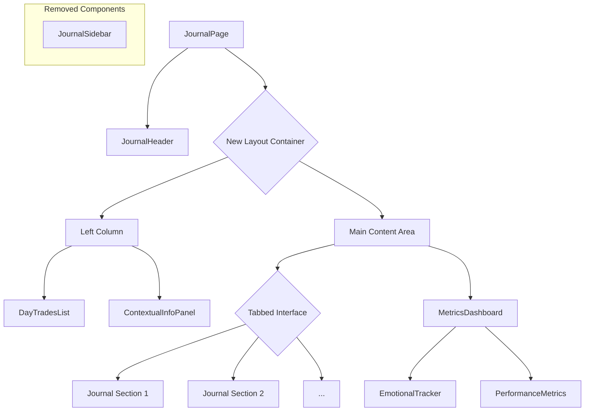

# Design Proposal: Single-Page Journal Refactor

## 1. Executive Summary

The current single-page journal implementation, while functional, suffers from a cramped and unintuitive layout. This proposal outlines a comprehensive redesign focused on improving usability, scalability, and responsiveness. The core of this proposal is to deconstruct the overloaded sidebar and create a more balanced, multi-column layout that provides a clear hierarchy for information and actions.

## 2. Problems with the Current Design

*   **Information Overload:** The sidebar contains too many complex components, making it difficult to parse.
*   **Poor Scalability:** The single-column layout for journal content does not scale well as more sections are added.
*   **Lack of Responsiveness:** The fixed-width sidebar and main content area do not adapt to different screen sizes.
*   **Hidden Functionality:** Key actions are relegated to small buttons in the header, reducing their visibility.

## 3. Proposed Layout Redesign

I propose a new, three-column layout that is both flexible and responsive, built using CSS Grid.

### 3.1. Layout Structure

```
+--------------------------------------------------------------------------------------+
| Journal Header                                                                       |
+--------------------------------------------------------------------------------------+
|                                                                                      |
| +------------------------+ +-------------------------------------------------------+ |
| |                        | |                                                       | |
| | Left Column            | | Main Content Area (Tabs)                              | |
| | (Day's Trades)         | |                                                       | |
| |                        | |                                                       | |
| +------------------------+ +-------------------------------------------------------+ |
|                          |                                                         |
| +------------------------+ +-------------------------------------------------------+ |
| |                        | |                                                       | |
| | Left Column            | | Emotional State & Performance Metrics                 | |
| | (Contextual Info)      | |                                                       | |
| |                        | |                                                       | |
| +------------------------+ +-------------------------------------------------------+ |
|                                                                                      |
+--------------------------------------------------------------------------------------+
```

### 3.2. Component Relocation Plan

*   **`JournalSidebar`:** This component will be completely removed.
*   **`DayTradesList`:** Will be moved to the top of the new left column, providing immediate context for the day's trading activity.
*   **`EmotionalTracker` & `PerformanceMetrics`:** These will be moved into a new component at the bottom of the main content area, possibly within a collapsible section to save space.
*   **`JournalContent`:** Will be refactored to support a tabbed interface, allowing users to switch between different journal sections without excessive scrolling.

## 4. Mermaid Diagram: New Component Architecture



## 5. Next Steps

1.  **Implement the new layout in `JournalPage.tsx` using CSS Grid.**
2.  **Create the new `TabbedInterface` component.**
3.  **Relocate `DayTradesList`, `EmotionalTracker`, and `PerformanceMetrics` to their new positions.**
4.  **Refactor `JournalContent` to work with the new tabbed layout.**
5.  **Ensure the entire page is responsive and works well on all screen sizes.**

This redesign will result in a more organized, intuitive, and scalable journaling experience.