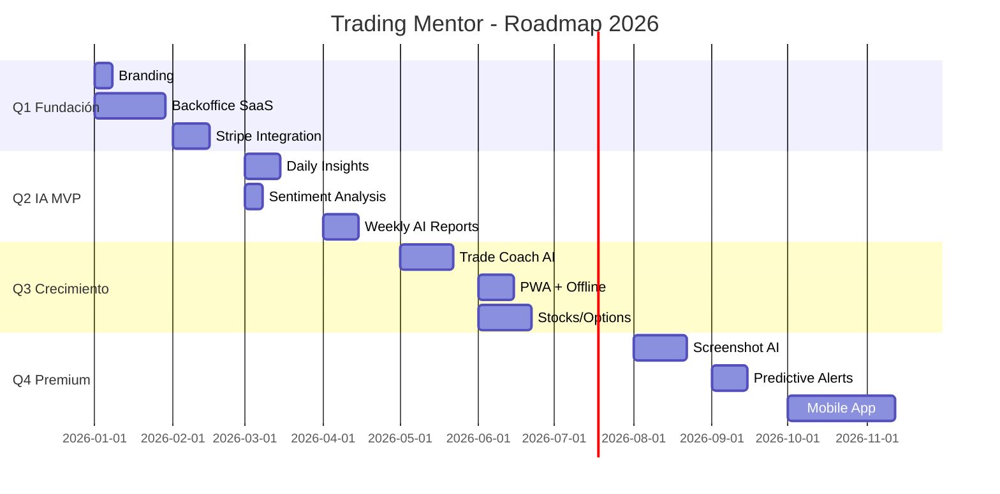
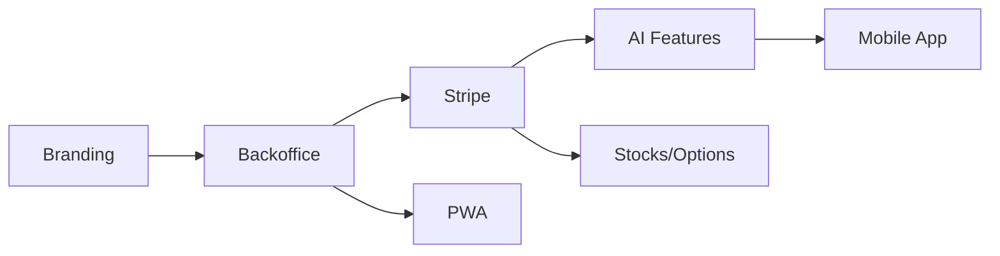

# 🗺️ Roadmap de Mejoras - Trading Mentor

> **Última actualización:** 24 de diciembre de 2025

---

## Visión General

---

## 📅 Q1 2026: Fundación SaaS (Enero - Marzo)

### Objetivo
Transformar la app en un SaaS monetizable con branding propio.

---

### 🎨 1.1 Rebranding (Semana 1)

| Tarea | Prioridad | Tiempo |
|-------|-----------|--------|
| Definir nuevo nombre y logo | 🔴 Alta | 1 día |
| Actualizar `index.html`, meta tags | 🔴 Alta | 2h |
| Renombrar "Zella Score" → nuevo nombre | 🟡 Media | 4h |
| Nuevos colores CSS | 🟡 Media | 2h |
| Favicon y assets | 🟡 Media | 2h |

**Workflow:** `/branding`

---

### 🏢 1.2 Backoffice SaaS (Semanas 2-5)

| Tarea | Prioridad | Tiempo |
|-------|-----------|--------|
| Sistema de roles (admin/user) | 🔴 Alta | 4h |
| Reglas Firestore para admins | 🔴 Alta | 2h |
| Panel Admin - Layout | 🔴 Alta | 3h |
| Dashboard métricas SaaS | 🔴 Alta | 5h |
| Dashboard métricas Trading | 🟡 Media | 4h |
| Gestión de usuarios | 🔴 Alta | 5h |
| Gestión de suscripciones | 🔴 Alta | 4h |

**Workflow:** `/backoffice-saas`

---

### 💳 1.3 Integración Stripe (Semanas 6-7)

| Tarea | Prioridad | Tiempo |
|-------|-----------|--------|
| Configurar cuenta Stripe | 🔴 Alta | 1h |
| Crear productos y precios | 🔴 Alta | 1h |
| Cloud Functions webhooks | 🔴 Alta | 5h |
| Página de pricing | 🔴 Alta | 4h |
| Checkout flow | 🔴 Alta | 3h |
| Portal de facturación | 🟡 Media | 2h |
| Límites por plan | 🔴 Alta | 4h |

**Dependencia:** Backoffice completado

---

### 📊 Planes de Suscripción Q1

| Plan | Precio | Límites |
|------|--------|---------|
| **Starter** | Gratis | 20 trades/mes, 1 cuenta |
| **Trader** | $15/mes | Ilimitado, 3 cuentas |
| **Prop** | $29/mes | +Challenges, +Alertas, +PDF |
| **Fund** | $99/mes | Multi-usuario, API |

---

### ✅ Entregables Q1

- [ ] App con branding propio
- [ ] Panel de administración funcional
- [ ] Sistema de pagos con Stripe
- [ ] 4 planes de suscripción activos
- [ ] Límites por plan implementados

### 📈 KPIs Q1

| Métrica | Objetivo |
|---------|----------|
| Usuarios registrados | 100 |
| Usuarios de pago | 10 |
| MRR | $200 |

---

## 🤖 Q2 2026: IA MVP (Abril - Junio)

### Objetivo
Lanzar funcionalidades de IA que impresionen y diferencien.

---

### 🧠 2.1 Daily AI Insights (Semanas 1-2)

| Tarea | Prioridad | Tiempo |
|-------|-----------|--------|
| Cloud Function `generateInsights` | 🔴 Alta | 5h |
| Prompt engineering | 🔴 Alta | 3h |
| Widget `AIInsightsWidget` | 🔴 Alta | 4h |
| Caché 24h | 🟡 Media | 2h |
| Rate limiting por plan | 🔴 Alta | 2h |

**Límites:** Free: 3/día | Paid: 5+/día

---

### 😰 2.2 Sentiment Analysis (Semana 3)

| Tarea | Prioridad | Tiempo |
|-------|-----------|--------|
| Cloud Function `analyzeSentiment` | 🔴 Alta | 3h |
| Componente `SentimentTags` | 🔴 Alta | 3h |
| Integrar en AddTrade | 🟡 Media | 2h |
| Guardar emociones en Firestore | 🟡 Media | 1h |

**Límites:** Free: 10/mes | Paid: 50+/mes

---

### 📊 2.3 Weekly AI Reports (Semanas 4-5)

| Tarea | Prioridad | Tiempo |
|-------|-----------|--------|
| Cloud Function `sendWeeklyReport` | 🔴 Alta | 4h |
| Template de email | 🟡 Media | 3h |
| Configurar SendGrid/Mailgun | 🟡 Media | 2h |
| Scheduler semanal | 🟡 Media | 1h |
| Preferencias de notificación | 🟢 Baja | 2h |

**Límites:** Free: 1 mensual | Paid: Semanal

---

### ✅ Entregables Q2

- [ ] Widget de AI Insights en dashboard
- [ ] Detección automática de emociones
- [ ] Emails semanales con AI
- [ ] Documentación de API IA

### 📈 KPIs Q2

| Métrica | Objetivo |
|---------|----------|
| Usuarios registrados | 500 |
| Usuarios de pago | 50 |
| MRR | $1,000 |
| % uso features AI | 60% |

---

## 📈 Q3 2026: Crecimiento (Julio - Septiembre)

### Objetivo
Expandir funcionalidades basándose en feedback de usuarios.

---

### 💬 3.1 Trade Coach AI (Semanas 1-3)

| Tarea | Prioridad | Tiempo |
|-------|-----------|--------|
| Sistema RAG con embeddings | 🔴 Alta | 8h |
| UI de chat | 🔴 Alta | 5h |
| Memoria de conversación | 🟡 Media | 3h |
| Preguntas sugeridas | 🟡 Media | 2h |
| Integración con datos del usuario | 🔴 Alta | 4h |

**Solo para:** Trader+ plans

---

### 🔍 3.2 Pattern Detection (Semanas 4-5)

| Tarea | Prioridad | Tiempo |
|-------|-----------|--------|
| Algoritmos de detección | 🔴 Alta | 6h |
| UI de patrones detectados | 🟡 Media | 4h |
| Alertas de patrones negativos | 🟡 Media | 3h |
| Dashboard de patterns | 🟡 Media | 3h |

---

### 📱 3.3 PWA + Offline (Semana 6)

| Tarea | Prioridad | Tiempo |
|-------|-----------|--------|
| Service Worker | 🔴 Alta | 4h |
| Manifest.json | 🔴 Alta | 1h |
| Offline sync | 🟡 Media | 4h |
| Push notifications | 🟡 Media | 3h |
| Install prompt | 🟢 Baja | 1h |

---

### 📊 3.4 Soporte Stocks y Opciones (Semanas 7-9)

| Tarea | Prioridad | Tiempo |
|-------|-----------|--------|
| Extender modelo Trade | 🔴 Alta | 4h |
| UI para stocks | 🔴 Alta | 5h |
| UI para opciones | 🔴 Alta | 6h |
| Cálculos específicos | 🟡 Media | 4h |
| Migración de datos | 🟡 Media | 2h |

**Demanda:** Issue #1 del repositorio original

---

### ✅ Entregables Q3

- [ ] Trade Coach AI funcional
- [ ] Detección de patrones
- [ ] App instalable (PWA)
- [ ] Soporte Stocks/Opciones

### 📈 KPIs Q3

| Métrica | Objetivo |
|---------|----------|
| Usuarios registrados | 2,000 |
| Usuarios de pago | 200 |
| MRR | $4,000 |
| Retención 30 días | 50% |

---

## 🚀 Q4 2026: Premium (Octubre - Diciembre)

### Objetivo
Funcionalidades premium y diferenciación máxima.

---

### 📸 4.1 Screenshot Analysis (Semanas 1-3)

| Tarea | Prioridad | Tiempo |
|-------|-----------|--------|
| Integrar Vision API | 🔴 Alta | 5h |
| UI de análisis | 🔴 Alta | 4h |
| Detección de patrones gráficos | 🟡 Media | 6h |
| Sugerencias basadas en historial | 🟡 Media | 4h |

**Solo para:** Prop+ plans

---

### ⚠️ 4.2 Predictive Prop Firm Alerts (Semanas 4-5)

| Tarea | Prioridad | Tiempo |
|-------|-----------|--------|
| Modelo de predicción | 🔴 Alta | 6h |
| Dashboard de riesgo | 🔴 Alta | 4h |
| Alertas automáticas | 🔴 Alta | 3h |
| Email/Push notifications | 🟡 Media | 2h |

**Solo para:** Prop+ plans

---

### 📱 4.3 App Móvil Nativa (Semanas 6-11)

| Tarea | Prioridad | Tiempo |
|-------|-----------|--------|
| Setup React Native | 🔴 Alta | 4h |
| Auth flow | 🔴 Alta | 6h |
| Dashboard móvil | 🔴 Alta | 8h |
| Quick Add Trade | 🔴 Alta | 5h |
| Notifications | 🟡 Media | 4h |
| App Store submission | 🟡 Media | 4h |

---

### 👥 4.4 Comunidad (Semana 12)

| Tarea | Prioridad | Tiempo |
|-------|-----------|--------|
| Leaderboards anónimos | 🟡 Media | 4h |
| Perfiles públicos opcionales | 🟢 Baja | 3h |
| Challenges comunitarios | 🟢 Baja | 5h |

---

### ✅ Entregables Q4

- [ ] Análisis de screenshots con IA
- [ ] Alertas predictivas para prop firms
- [ ] App móvil en App Store/Play Store
- [ ] Funciones de comunidad

### 📈 KPIs Q4

| Métrica | Objetivo |
|---------|----------|
| Usuarios registrados | 5,000 |
| Usuarios de pago | 500 |
| MRR | $10,000 |
| Descargas app móvil | 1,000 |

---

## 📊 Resumen Anual

| Trimestre | Foco | MRR Objetivo |
|-----------|------|--------------|
| Q1 | Fundación SaaS | $200 |
| Q2 | IA MVP | $1,000 |
| Q3 | Crecimiento | $4,000 |
| Q4 | Premium | $10,000 |

---

## 🎯 Prioridades Inmediatas (Próximos 30 días)

1. **Ejecutar `/branding`** → Personalizar la app
2. **Crear cuenta Stripe** → Preparar monetización
3. **Activar Firebase Blaze** → Requisito para Cloud Functions
4. **Ejecutar `/backoffice-saas`** → Panel de admin

---

## 📁 Workflows Disponibles

| Comando | Descripción |
|---------|-------------|
| `/branding` | Cambiar nombre, colores, logos |
| `/backoffice-saas` | Panel admin + Stripe + planes |
| `/ai-features` | Implementar IA en 3 fases |

---

## 🔗 Dependencias Críticas

---

## 📝 Notas

- Los tiempos son estimados y pueden variar
- Prioridades pueden cambiar según feedback de usuarios
- Costos de API de IA: ~$0.01-0.05 por request
- Firebase Blaze: ~$1-5/mes para uso moderado
