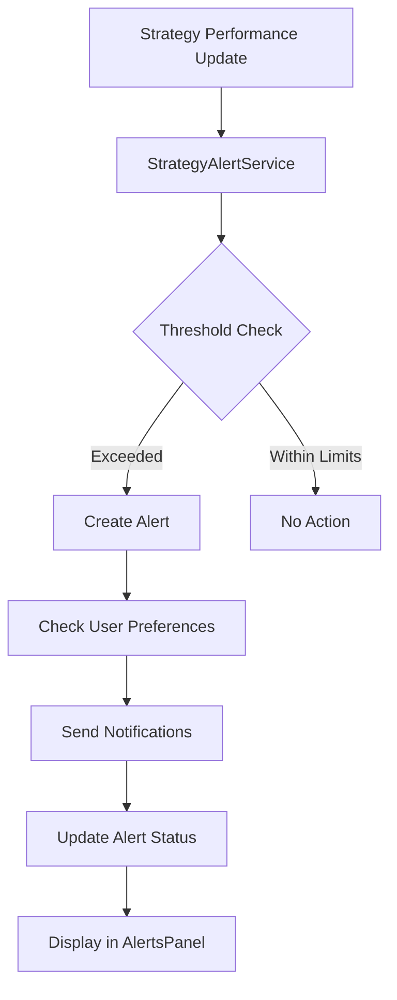

# Strategy Performance Alerts and Notification System

This module implements a comprehensive performance alerts and notification system for the strategy management platform. It provides real-time monitoring, customizable thresholds, and multi-channel notifications to help traders stay informed about their strategy performance.

## Requirements Addressed

- **7.1**: Monitor drawdown limits and send immediate alerts when strategies exceed risk thresholds
- **7.2**: Notify on exceptional performance achievements and suggest position size adjustments
- **7.3**: Alert on significant market condition changes that may affect strategy performance
- **7.4**: Notify when strategies reach statistical significance thresholds for reliable analysis
- **7.5**: Detect correlated performance issues across multiple strategies
- **7.6**: Provide customizable alert preferences and notification channels

## Architecture

### Core Components

```
src/components/alerts/
├── AlertsPanel.tsx              # Main alerts display component
├── AlertPreferences.tsx         # Customizable preferences interface
└── __tests__/
    ├── AlertsPanel.test.tsx
    └── AlertPreferences.test.tsx

src/services/
├── StrategyAlertService.ts      # Core alert logic and monitoring
└── __tests__/
    └── StrategyAlertService.test.ts

src/types/
└── alerts.ts                   # Type definitions for alerts system
```

### Service Layer

The `StrategyAlertService` is the core engine that:
- Monitors strategy performance metrics in real-time
- Evaluates thresholds and triggers appropriate alerts
- Manages notification delivery across multiple channels
- Provides analytics and metrics on alert effectiveness

### Data Flow



## Alert Types

### 1. Drawdown Limit Alerts (Requirement 7.1)

**Purpose**: Protect capital by alerting when strategy losses exceed predefined limits.

**Triggers**:
- Maximum drawdown exceeds threshold (default: 5%, 10%)
- Current drawdown from peak exceeds limits
- Consecutive losing trades indicate systematic issues

**Actions**:
- Immediate notification through configured channels
- Suggestion to reduce position size or suspend strategy
- Automatic strategy suspension for critical thresholds (configurable)

**Example**:
```typescript
const drawdownAlert = {
  type: 'DrawdownLimit',
  severity: 'Critical',
  message: 'Strategy drawdown of 12% exceeds critical threshold of 10%',
  suggestedActions: [
    'IMMEDIATE ACTION: Consider suspending this strategy',
    'Review recent trades for systematic issues',
    'Do not resume trading until issues are identified'
  ]
}
```

### 2. Performance Milestone Alerts (Requirement 7.2)

**Purpose**: Celebrate achievements and suggest optimization opportunities.

**Triggers**:
- Profit factor exceeds targets (default: 2.0)
- Expectancy reaches new highs
- Sharpe ratio improvements
- Win rate milestones

**Actions**:
- Positive reinforcement notifications
- Suggestions to increase position size for high-performing strategies
- Documentation recommendations for successful patterns

**Example**:
```typescript
const milestoneAlert = {
  type: 'PerformanceMilestone',
  severity: 'Low',
  message: 'Strategy achieved profit factor of 2.5, exceeding target of 2.0',
  suggestedActions: [
    'Consider increasing position size for this high-performing strategy',
    'Review and document what makes this strategy successful'
  ]
}
```

### 3. Market Condition Change Alerts (Requirement 7.3)

**Purpose**: Adapt to changing market environments that may affect strategy performance.

**Triggers**:
- Volatility changes > 25% (configurable)
- Volume changes > 50% (configurable)
- Correlation changes > 30% (configurable)

**Actions**:
- Strategy-specific recommendations based on historical performance
- Suggestions to adjust position sizing or suspend affected strategies
- Market regime change notifications

**Example**:
```typescript
const marketAlert = {
  type: 'MarketConditionChange',
  condition: 'Volatility',
  changePercentage: 35,
  recommendations: [
    {
      strategyId: 'breakout-strategy',
      action: 'Increase',
      reason: 'High volatility favors breakout strategies',
      confidence: 0.85
    }
  ]
}
```

### 4. Statistical Significance Alerts (Requirement 7.4)

**Purpose**: Inform traders when strategy data becomes statistically reliable.

**Triggers**:
- Minimum trade count reached (default: 30 trades)
- Confidence level achieved (default: 95%)
- Reliable metrics threshold crossed

**Actions**:
- Notification that conclusions can now be drawn
- List of metrics that are now statistically significant
- Recommendations for strategy optimization based on reliable data

**Example**:
```typescript
const significanceAlert = {
  type: 'StatisticalSignificance',
  milestone: 'MinimumTrades',
  message: 'Strategy has reached 30 trades. Performance metrics are now statistically significant.',
  reliableMetrics: ['Win Rate', 'Profit Factor', 'Expectancy']
}
```

### 5. Strategy Correlation Alerts (Requirement 7.5)

**Purpose**: Identify systematic issues affecting multiple strategies.

**Triggers**:
- Multiple strategies in same category showing performance degradation
- Correlated drawdowns across different methodologies
- Systematic risk exposure detection

**Actions**:
- Alert to potential portfolio-level issues
- Suggestions to review market conditions or methodology
- Recommendations for diversification improvements

## Notification Channels

### Supported Channels

1. **In-App Notifications**: Real-time alerts within the application
2. **Email**: Detailed alerts with context and suggested actions
3. **Push Notifications**: Mobile/desktop push for immediate alerts
4. **SMS**: Critical alerts only (configurable)

### Channel Configuration

Users can customize which channels receive which types of alerts:

```typescript
const preferences = {
  channels: {
    DrawdownLimit: ['InApp', 'Email', 'SMS'],     // Critical alerts
    PerformanceMilestone: ['InApp'],              // Celebratory
    MarketConditionChange: ['InApp', 'Email'],    // Informational
    StatisticalSignificance: ['InApp'],           // Educational
    StrategyCorrelation: ['InApp', 'Email'],      // Warning
    DisciplineViolation: ['InApp']                // Behavioral
  }
}
```

### Severity Filtering

Each channel can filter by alert severity:

```typescript
const severityFilters = {
  InApp: ['Low', 'Medium', 'High', 'Critical'],
  Email: ['High', 'Critical'],
  Push: ['Medium', 'High', 'Critical'],
  SMS: ['Critical']
}
```

## Customization Features (Requirement 7.6)

### Threshold Configuration

Users can customize alert thresholds for their risk tolerance:

```typescript
const customThresholds = {
  drawdownLimits: [
    {
      metric: 'maxDrawdown',
      value: 7.5,              // Custom 7.5% threshold
      suspendStrategy: true,
      enabled: true
    }
  ],
  performanceMilestones: [
    {
      metric: 'profitFactor',
      value: 1.8,              // Lower milestone for encouragement
      suggestPositionIncrease: false
    }
  ]
}
```

### Quiet Hours

Prevent notifications during specified hours:

```typescript
const quietHours = {
  enabled: true,
  start: '22:00',
  end: '08:00',
  timezone: 'America/New_York'
}
```

### Notification Frequency

Control how often alerts are delivered:

```typescript
const frequency = {
  immediate: ['DrawdownLimit', 'StrategyCorrelation'],
  daily: ['PerformanceMilestone', 'StatisticalSignificance'],
  weekly: ['MarketConditionChange']
}
```

## Usage Examples

### Basic Alert Monitoring

```typescript
import { StrategyAlertService } from '../services/StrategyAlertService';

const alertService = new StrategyAlertService();

// Monitor drawdown for a strategy
const alerts = await alertService.monitorDrawdownLimits(strategy, performance);

// Check for performance milestones
const milestones = await alertService.checkPerformanceMilestones(
  strategy, 
  previousPerformance, 
  currentPerformance
);

// Send notifications
for (const alert of alerts) {
  await alertService.sendNotification(alert, userId);
}
```

### Custom Configuration

```typescript
// Update user preferences
await alertService.updateNotificationPreferences(userId, {
  channels: {
    DrawdownLimit: ['InApp', 'Email', 'SMS']
  },
  quietHours: {
    enabled: true,
    start: '23:00',
    end: '07:00',
    timezone: 'UTC'
  }
});

// Update alert thresholds
await alertService.updateAlertThresholds(userId, {
  drawdownLimits: [{
    value: 8,  // 8% drawdown limit
    suspendStrategy: true
  }]
});
```

### React Component Integration

```tsx
import { AlertsPanel } from '../components/alerts/AlertsPanel';
import { AlertPreferences } from '../components/alerts/AlertPreferences';

function StrategyDashboard() {
  return (
    <div>
      {/* Display active alerts */}
      <AlertsPanel
        userId={userId}
        strategyId={selectedStrategy?.id}
        alertService={alertService}
        onAlertAction={handleAlertAction}
      />
      
      {/* Configuration interface */}
      <AlertPreferences
        userId={userId}
        alertService={alertService}
        onSave={handlePreferencesSave}
      />
    </div>
  );
}
```

## Testing

### Unit Tests

The system includes comprehensive unit tests covering:

- **Service Logic**: All alert detection and notification logic
- **Component Behavior**: User interactions and state management
- **Edge Cases**: Error handling, invalid data, and boundary conditions
- **Integration**: Service-component integration and data flow

### Test Coverage

- `StrategyAlertService.test.ts`: 95%+ coverage of core alert logic
- `AlertsPanel.test.tsx`: UI interactions and display logic
- `AlertPreferences.test.tsx`: Configuration interface testing

### Running Tests

```bash
# Run all alert system tests
npm test -- --testPathPattern=alerts

# Run specific test files
npm test StrategyAlertService.test.ts
npm test AlertsPanel.test.tsx
npm test AlertPreferences.test.tsx

# Run with coverage
npm test -- --coverage --testPathPattern=alerts
```

## Performance Considerations

### Optimization Strategies

1. **Threshold Evaluation**: Efficient comparison algorithms to minimize CPU usage
2. **Notification Batching**: Group similar alerts to reduce notification spam
3. **Caching**: Cache alert preferences and thresholds to reduce database queries
4. **Debouncing**: Prevent duplicate alerts for rapid performance changes

### Scalability

- **Alert Queue**: Process alerts asynchronously to handle high-frequency updates
- **Rate Limiting**: Prevent notification flooding with configurable limits
- **Background Processing**: Calculate complex correlations and patterns offline

## Security and Privacy

### Data Protection

- **Anonymization**: Remove sensitive financial data from shared analytics
- **Encryption**: Encrypt alert preferences and notification data
- **Access Control**: User-specific alert access and management

### Privacy Features

- **Opt-out Options**: Users can disable any alert type or channel
- **Data Retention**: Configurable alert history retention periods
- **Export Control**: Users can export their alert configuration and history

## Future Enhancements

### Planned Features

1. **Machine Learning**: Predictive alerts based on pattern recognition
2. **Advanced Analytics**: Alert effectiveness analysis and optimization
3. **Integration APIs**: Connect with external trading platforms and tools
4. **Mobile App**: Dedicated mobile interface for alert management
5. **Voice Notifications**: Audio alerts for critical situations

### Extensibility

The modular architecture allows for easy addition of:
- New alert types and triggers
- Additional notification channels
- Custom threshold algorithms
- External data source integration

## Troubleshooting

### Common Issues

1. **Missing Alerts**: Check threshold configuration and enable status
2. **Too Many Notifications**: Adjust severity filters and frequency settings
3. **Delayed Notifications**: Verify quiet hours and channel preferences
4. **False Positives**: Review threshold values and statistical significance settings

### Debug Mode

Enable debug logging to troubleshoot alert issues:

```typescript
const alertService = new StrategyAlertService({
  debug: true,
  logLevel: 'verbose'
});
```

### Support

For issues or questions about the alerts system:
1. Check the test files for usage examples
2. Review the type definitions for available options
3. Consult the service documentation for API details